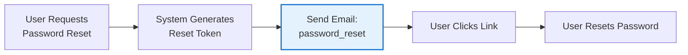
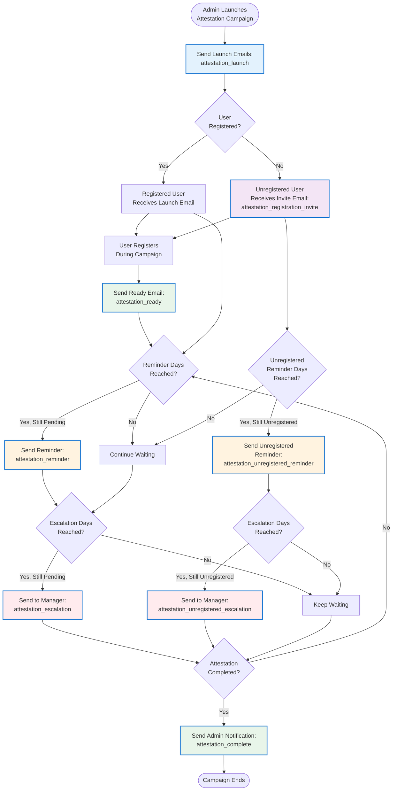
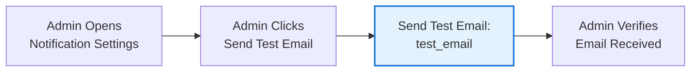

# KARS (KeyData Asset Registration System)

[](https://github.com/humac/kars/actions)
[](https://www.docker.com/)
[](LICENSE)

A web application that supports organizational SOC2 compliance by tracking client assets assigned to consultants, with full authentication, role-based access control, and automated deployment.

🌐 **Live Demo:** [https://kars.jvhlabs.com](https://kars.jvhlabs.com)

📖 **Documentation:** [View Wiki](../../wiki)

🔄 **Schema Update:** [Migration Guide](SCHEMA-MIGRATION.md) - Important: Now supports multiple asset types (laptops, mobile phones). Breaking change - requires fresh database.

---

## 🎯 Purpose

KARS helps consulting organizations maintain accountability for client-owned assets (laptops, mobile devices) assigned to their consultants. This supports:

- **SOC2 Audit Requirements** - Demonstrable tracking of client assets under your custody
- **Regular Attestation** - Automated workflows for employees to certify assets they hold
- **Client Trust** - Transparent asset stewardship reporting
- **Risk Management** - Quick identification of lost, damaged, or unreturned equipment
- **Compliance Evidence** - Exportable audit trails and attestation records for auditor review

---

## ✨ Features

### 🔐 Authentication & Security
- **JWT Authentication** - Secure token-based auth with 7-day expiration
- **Passkey/WebAuthn Support** - Passwordless authentication with biometrics
  - FIDO2/WebAuthn standard compliance
  - Platform authenticators (Touch ID, Face ID, Windows Hello)
  - Security key support (YubiKey, etc.)
  - Register and manage multiple passkeys from profile
  - Passwordless sign-in option on login page
- **Multi-Factor Authentication (MFA/2FA)** - TOTP-based authentication with backup codes
  - QR code enrollment with authenticator apps (Google, Microsoft, Authy)
  - 10 backup codes for account recovery
  - User-controlled enable/disable from profile
- **OIDC/SSO Authentication** - External identity provider integration
  - Support for Auth0, Google Workspace, Azure AD, Okta
  - Just-In-Time (JIT) user provisioning
  - Role mapping from OIDC claims
  - Database-backed configuration (admin UI)
- **Password Security** - bcrypt hashing (10 rounds)
- **Password Management** - Change password from profile settings
- **Password Reset** - Email-based password reset flow with secure tokens
  - Request reset link from login page
  - Time-limited tokens (1-hour expiration)
  - One-time use tokens with automatic cleanup
  - Audit logging for all password reset events

### ✅ Attestation Workflow
- **Campaign-Based Certification** - Admins create attestation campaigns with configurable schedules
- **Employee Self-Service** - Employees review and confirm assets in their possession
- **Automated Reminders** - Email notifications for pending attestations
- **Manager Escalation** - Automatic escalation to managers for overdue attestations
- **Compliance Reporting** - Export attestation records for auditor review
- **New Asset Discovery** - Employees can report unregistered assets during attestation

### 🔐 Additional Security Features
- **Role-Based Access Control** - Four roles with distinct permissions (see detailed matrix below):
  - **Employee**: View/edit own assets and audit logs only
  - **Manager**: View all assets and audit logs; bulk import assets; read-only access to users page; cannot edit other users' assets or access admin settings
  - **Attestation Coordinator**: Manage attestation campaigns; read-only access to assets, users, companies, and audit logs; cannot access admin settings
  - **Admin**: Full access to all resources including admin settings, user management, and company management

### 📋 Role/Permissions Matrix

| Feature | Employee | Manager | Attestation Coordinator | Admin |
|---------|:--------:|:-------:|:----------------------:|:-----:|
| **Assets** | | | | |
| View own assets | ✅ | ✅ | ✅ | ✅ |
| View team assets (direct reports) | ❌ | ✅ | ✅ | ✅ |
| View all assets | ❌ | ✅ | ✅ (read-only) | ✅ |
| Register own assets | ✅ | ✅ | ❌ | ✅ |
| Register assets for others | ❌ | ✅ | ❌ | ✅ |
| Edit own assets | ✅ | ✅ | ❌ | ✅ |
| Edit team assets | ❌ | ❌ | ❌ | ✅ |
| Edit all assets | ❌ | ❌ | ❌ | ✅ |
| Bulk import assets (CSV) | ❌ | ✅ | ❌ | ✅ |
| **Companies** | | | | |
| View company names (dropdown) | ✅ | ✅ | ✅ | ✅ |
| View companies page | ❌ | ✅ | ✅ (read-only) | ✅ |
| Create companies | ❌ | ❌ | ❌ | ✅ |
| Edit companies | ❌ | ❌ | ❌ | ✅ |
| Delete companies | ❌ | ❌ | ❌ | ✅ |
| Bulk import companies (CSV) | ❌ | ❌ | ❌ | ✅ |
| **Users** | | | | |
| View users page | ❌ | ✅ (read-only) | ✅ (read-only) | ✅ |
| Add new users | ❌ | ❌ | ❌ | ✅ |
| Edit user roles | ❌ | ❌ | ❌ | ✅ |
| Delete users | ❌ | ❌ | ❌ | ✅ |
| **Audit & Reporting** | | | | |
| View own audit logs | ✅ | ✅ | ✅ | ✅ |
| View team audit logs | ❌ | ✅ | ✅ | ✅ |
| View all audit logs | ❌ | ✅ | ✅ | ✅ |
| Export audit logs (CSV) | ✅ (own) | ✅ (all) | ✅ (all) | ✅ (all) |
| View summary reports | ✅ (own) | ✅ (all) | ✅ (all) | ✅ (all) |
| **Attestations** | | | | |
| View own pending attestations | ✅ | ✅ | ✅ | ✅ |
| Submit attestations | ✅ | ✅ | ✅ | ✅ |
| View own attestation history | ✅ | ✅ | ✅ | ✅ |
| View team attestation status | ❌ | ✅ | ✅ | ✅ |
| View all attestation reports | ❌ | ❌ | ✅ | ✅ |
| Create/manage campaigns | ❌ | ❌ | ✅ | ✅ |
| Export attestation records | ❌ | ❌ | ✅ | ✅ |
| **Profile & Security** | | | | |
| Update own profile | ✅ | ✅ | ✅ | ✅ |
| Change own password | ✅ | ✅ | ✅ | ✅ |
| Enable/disable MFA | ✅ | ✅ | ✅ | ✅ |
| Register passkeys | ✅ | ✅ | ✅ | ✅ |
| **Admin Settings** | | | | |
| Access Admin Settings | ❌ | ❌ | ❌ | ✅ |
| Configure OIDC/SSO | ❌ | ❌ | ❌ | ✅ |
| Configure passkey settings | ❌ | ❌ | ❌ | ✅ |
| Manage branding | ❌ | ❌ | ❌ | ✅ |
| Configure database engine | ❌ | ❌ | ❌ | ✅ |
| Configure email/SMTP | ❌ | ❌ | ❌ | ✅ |

- **Automatic Manager Promotion** - Users listed as a manager are auto-promoted to manager with audit logging
- **First Admin Setup** - Automatic admin promotion for first user
- **Profile Management** - Update first/last name, password, MFA settings, passkeys, and manager details
- **Manager Change Propagation** - When a user's manager is updated (by admin or self), all assets owned by that user automatically update to reference the new manager
- **Branding Controls** - Admins can upload a custom logo and branding name from the UI

### 📦 Asset Management
- **Multi-Type Asset Support** - Track laptops, mobile phones, and other assets
  - Asset type selector (laptop, mobile phone)
  - Generic fields: make, model, serial number, asset tag
- **Self-Service Registration** - Consultants register client assets with separated name fields for better data quality
  - Employee first/last name, email (prepopulated and readonly for employees)
  - Manager first/last name, email (prepopulated from employee profile for employees)
  - Company dropdown (populated from system companies)
  - Asset details, serial number, asset tag, status, notes
- **Status Tracking** - Active, Returned, Lost, Damaged, Retired
- **Advanced Search** - Filter by employee, manager, client, status
- **Role-Based Visibility & Authorization**:
  - Employees: View only their own assets; can edit only their own assets
  - Managers: View all assets (same as admins); cannot edit employee assets
  - Admins: View and edit all assets
- **Automatic Manager Sync** - When an employee's manager changes, all their assets are automatically updated with the new manager reference
- **Bulk Import/Export** - CSV importers for assets (with separated name fields) and companies plus CSV audit export

### 🏢 Company Management (Admin Only)
- Create, edit, and delete client companies
- Company dropdown for asset registration
- Protection against deletion if assets exist
- Bulk company import via CSV

### 📊 Audit & Compliance
- **Complete Audit Trail** - All actions logged with user attribution
- **SOC2 Compliance Support** - Provides audit evidence for organizational compliance
- **Comprehensive Logging** - CREATE, UPDATE, STATUS_CHANGE, DELETE
- **CSV Export** - Role-filtered audit log downloads for compliance
- **Summary Reports** - Asset statistics by status, company, manager
- **Secure Exports** - Role-based access control on all exports

### ⚙️ Admin Features
- **User Management** - Dedicated Users page accessible to managers (read-only) and admins (full access)
  - Add new users with specified roles
  - Edit roles and user attributes
  - Bulk operations and user deletion
  - Manager read-only access for viewing team members
- **System Overview** - System information and admin navigation guide
- **Application Settings** - Configuration and best practices
- **OIDC/SSO Configuration** - Database-backed SSO settings with admin UI
- **Passkey Settings** - Configure relying party name/ID and origin from the UI
- **Branding** - Upload and reset custom logos and app names
- **Email Notifications** - SMTP configuration for system notifications
  - Secure password encryption at rest (AES-256-GCM)
  - Support for TLS/SSL and multiple auth methods
  - Test email functionality
  - Admin-only access to settings
- **Database Engine Selection** - Switch between SQLite and PostgreSQL (with SQLite-to-Postgres import helper)
- **Audit Access** - View all system activity

### 🚀 Deployment & DevOps
- **Multi-Platform Docker Support** - ARM64 and AMD64 containers
- **GitHub Actions CI/CD** - Automated builds and deployment
- **Portainer Integration** - Webhook-based deployment with auto-pull
- **Cloudflare Tunnel** - Secure external access with SSL
- **Health Checks** - Automated container monitoring
- **Auto-Restart** - Self-healing containers
- **Modern Material-UI Interface** - Professional design with responsive layout

---

## 🖥️ Platform Support

This application supports multiple architectures:
- **x86_64/AMD64** - Intel/AMD processors (standard servers, desktop)
- **ARM64** - ARM processors (Raspberry Pi, AWS Graviton, Apple Silicon)

Docker images are automatically built for both platforms during CI/CD.

---

## 📋 Prerequisites

**For Development:**
- **Node.js 22.x LTS** (required for backend native modules like better-sqlite3)
- npm or yarn package manager
- Git

**For Production Deployment:**
- Docker and Docker Compose
- (Optional) Portainer for container management

---

## 🎯 Quick Start

### For Users

```bash
# 1. Access the application
https://kars.jvhlabs.com

# 2. Register (first user becomes admin!)
Click "Register" → Fill form → Auto-login

# 3. Register an asset
Asset Management → + New Asset → Fill details → Register

# 4. Optional security upgrades
Enable MFA or register a passkey from your profile
```

### For Developers

```bash
# 1. Clone and install dependencies
git clone https://github.com/humac/kars.git
cd kars

# 2. Backend setup
cd backend
npm install
cp .env.example .env
# Set JWT_SECRET and (optional) PASSKEY_* / OIDC_* values
npm run dev  # starts API on http://localhost:3001

# 3. Frontend setup (new terminal)
cd frontend
npm install
npm run dev   # starts UI on http://localhost:5173
```

- First registered account becomes **Admin** automatically (or set `ADMIN_EMAIL` in the backend `.env`).
- Passkeys require the frontend origin to match `PASSKEY_ORIGIN` (default `http://localhost:5173`).
- Enable OIDC/SSO from the admin UI after setting issuer/client credentials.
- For email notifications, set `KARS_MASTER_KEY` environment variable for password encryption (see below).
- For password reset emails, configure `BASE_URL` (application URL) and optionally `ALLOWED_ORIGINS` (comma-separated list of allowed origins for security).

### Manual Backup

```bash
# Create a compressed backup of the SQLite volume
docker run --rm \
  -v asset-data:/data \
  -v $(pwd):/backup \
  alpine tar czf /backup/asset-data-$(date +%Y%m%d).tar.gz -C /data .
```

### Restore Database

```bash
# Restore from backup
docker run --rm \
  -v asset-data:/data \
  -v $(pwd):/backup \
  alpine tar xzf /backup/asset-data-YYYYMMDD.tar.gz -C /data
```

### Configure Email Notifications

Email notifications (including password reset emails) require SMTP configuration accessible from **Admin Settings → Notifications**.

1. **Generate Master Encryption Key** (required for password encryption at rest):
   ```bash
   # Generate a secure 256-bit encryption key
   node -e "console.log(require('crypto').randomBytes(32).toString('base64'))"
   ```

2. **Set Environment Variable**:
   ```bash
   # Add to backend/.env
   KARS_MASTER_KEY=your-generated-key-here
   ```

3. **Configure SMTP Settings** (from Admin Settings UI):
   - Enable notifications
   - Enter SMTP host and port (e.g., smtp.gmail.com:587)
   - Enable TLS/SSL (recommended)
   - Set authentication method (Plain, Login, CRAM-MD5, or None)
   - Enter username and password (encrypted at rest)
   - Configure "From" email and name
   - Set default test recipient (optional)
   - Click "Save Settings"

4. **Test Configuration**:
   - Click "Send Test Email" button
   - Enter recipient email
   - Check for test email delivery

**Security Note:** SMTP passwords are encrypted using AES-256-GCM before storage. The `KARS_MASTER_KEY` must remain secure and consistent across deployments.

### Configure Attestation Scheduler

For automated attestation reminders and escalations:

```bash
# Add to backend/.env
RUN_ATTESTATION_SCHEDULER=true  # Enable automated scheduler
FRONTEND_URL=http://localhost:5173  # Base URL for email links (adjust for production)
```

**Note:** The attestation scheduler runs daily checks for:
- Sending reminder emails to employees with pending attestations
- Escalating overdue attestations to managers
- Auto-closing campaigns past their end date

---

## 📧 Email Notification Workflows

KARS includes a comprehensive email notification system to support password reset workflows and attestation campaigns. All email notifications require SMTP configuration (see "Configure Email Notifications" above). Email templates are fully customizable via **Admin Settings → Notifications → Email Templates**.

**Scheduler Note:** When `RUN_ATTESTATION_SCHEDULER=true` is enabled, the scheduler runs daily automated checks for reminders, escalations, and campaign closures.

### 1. Password Reset Flow



**Email Template:** `password_reset`  
**Trigger:** User requests password reset from login page  
**Frequency:** On-demand (user-initiated)  
**Recipients:** User requesting reset

---

### 2. Attestation Campaign Lifecycle

This diagram shows the complete attestation workflow with all email touchpoints from campaign launch through completion.



#### Campaign Launch
- **Template:** `attestation_launch`
- **Trigger:** Admin launches a new attestation campaign
- **Frequency:** Once per campaign launch
- **Recipients:** All employees with assets (registered users only)

#### Registration Invite (for unregistered asset owners)
- **Template:** `attestation_registration_invite`
- **Trigger:** Campaign launch finds assets assigned to unregistered emails
- **Frequency:** Once per campaign for each unregistered email
- **Recipients:** Unregistered users with assets

#### Attestation Ready (for newly registered users)
- **Template:** `attestation_ready`
- **Trigger:** User registers during an active campaign
- **Frequency:** Once per user registration during active campaign
- **Recipients:** Newly registered user

#### Attestation Reminder
- **Template:** `attestation_reminder`
- **Trigger:** Scheduler runs after `reminder_days` from campaign start
- **Frequency:** Daily scheduler check; sent once per pending attestation
- **Recipients:** Employees with pending attestations
- **Condition:** Only for pending attestations that haven't received a reminder

#### Unregistered User Reminder
- **Template:** `attestation_unregistered_reminder`
- **Trigger:** Scheduler runs after `unregistered_reminder_days` from campaign start
- **Frequency:** Daily scheduler check; sent once per unregistered user
- **Recipients:** Unregistered users with assets
- **Condition:** User still hasn't registered

#### Attestation Escalation (to manager)
- **Template:** `attestation_escalation`
- **Trigger:** Scheduler runs after `escalation_days` from campaign start
- **Frequency:** Daily scheduler check; sent once per overdue attestation
- **Recipients:** Employee's manager
- **Condition:** Employee hasn't completed attestation

#### Unregistered User Escalation (to manager)
- **Template:** `attestation_unregistered_escalation`
- **Trigger:** Scheduler runs after `escalation_days` from campaign start
- **Frequency:** Daily scheduler check; sent once per unregistered user
- **Recipients:** Manager listed on assets
- **Condition:** Asset owner still hasn't registered

#### Attestation Complete (confirmation to admin)
- **Template:** `attestation_complete`
- **Trigger:** Employee completes their attestation
- **Frequency:** Once per completed attestation
- **Recipients:** Admin users

---

### 3. SMTP Test Email



**Email Template:** `test_email`  
**Trigger:** Admin clicks "Send Test Email" in notification settings  
**Frequency:** On-demand (admin-initiated)  
**Recipients:** Test recipient specified by admin

---

### Email Templates Reference Table

All email templates are customizable via **Admin Settings → Notifications → Email Templates**. Each template supports variable substitution using `{{variableName}}` syntax.

| Template Key | Template Name | Description | Trigger Event | Frequency | Recipient Type |
|--------------|---------------|-------------|---------------|-----------|----------------|
| `test_email` | Test Email | SMTP configuration verification | Admin sends test | On-demand | Admin-specified |
| `password_reset` | Password Reset | Secure password reset with time-limited token | User requests reset | On-demand | User |
| `attestation_launch` | Attestation Campaign Launch | Notifies employees of new attestation campaign | Campaign launched | Once per campaign | Registered employees with assets |
| `attestation_registration_invite` | Registration Invite | Invites unregistered asset owners to register | Campaign finds unregistered owners | Once per campaign per unregistered email | Unregistered users with assets |
| `attestation_ready` | Attestation Ready | Notifies newly registered users attestation is ready | User registers during campaign | Once per registration | Newly registered user |
| `attestation_reminder` | Attestation Reminder | Reminds employees of pending attestation | Scheduler after reminder_days | Once per pending attestation | Employees with pending attestations |
| `attestation_unregistered_reminder` | Unregistered User Reminder | Reminds unregistered users to register | Scheduler after unregistered_reminder_days | Once per unregistered user | Unregistered users |
| `attestation_escalation` | Attestation Escalation | Notifies managers of overdue employee attestations | Scheduler after escalation_days | Once per overdue attestation | Employee's manager |
| `attestation_unregistered_escalation` | Unregistered User Escalation | Notifies managers of unregistered team members | Scheduler after escalation_days | Once per unregistered user | Manager on assets |
| `attestation_complete` | Attestation Complete | Confirms attestation completion to admins | Employee completes attestation | Once per completion | Admin users |

**Note:** The attestation scheduler processes reminders and escalations through daily automated checks when `RUN_ATTESTATION_SCHEDULER=true` is enabled.

---

## 🐛 Troubleshooting

### Containers Won't Start
```bash
# Check logs
docker logs asset-registration-backend
docker logs asset-registration-frontend

# Check ports
netstat -tlnp | grep 8080

# Restart
docker-compose restart
```

### Can't Access Application
- Check containers are running: `docker ps`
- Verify Cloudflare tunnel status
- Test locally: `curl http://localhost:8080`

### Database Issues
```bash
# View database
docker exec -it asset-registration-backend sh
cd /app/data
ls -la

# Reset (⚠️ deletes all data)
docker-compose down -v
docker-compose up -d
```

**More:** See the [wiki](../../wiki) for deployment and admin guides.

---

## 📦 Dependency Upgrade Roadmap

This section tracks planned dependency upgrades. Since KARS is currently in beta, we're taking a phased approach to upgrades.

### ✅ Completed (Phase 1 - December 2025)

| Component | Previous | Current | Notes |
|-----------|----------|---------|-------|
| Node.js | 18 LTS | **22 LTS** | Supported until April 2027 |
| better-sqlite3 | ^9.2.2 | **^11.0.0** | Node 22 compatibility |
| Vite | ^5.0.8 | **^6.0.0** | Faster builds |

### 🟡 Planned (Phase 2 - Q1 2026)

| Component | Current | Target | Notes |
|-----------|---------|--------|-------|
| Vitest | ^1.1.0 | ^2.x | Testing framework update |

### 🟠 Under Consideration (Phase 3 - Post-Beta)

| Component | Current | Target | Risk Level | Notes |
|-----------|---------|--------|------------|-------|
| Express | ^4.18.2 | 5.x | Medium | API changes - requires testing |
| React | ^18.2.0 | 19.x | Medium | New patterns (Server Components, Actions) |
| Tailwind CSS | ^3.4.18 | 4.x | Medium | New config format |

### Version Support Timeline

| Runtime | Version | Status | End of Life |
|---------|---------|--------|-------------|
| Node.js | 22 LTS | ✅ Current | April 2027 |
| Node.js | 20 LTS | Active | April 2026 |
| Node.js | 18 LTS | Maintenance | April 2025 |

**Last Updated:** December 2024

---

## 🤝 Contributing

Contributions welcome! Please:

1. Fork the repository
2. Create a feature branch (`git checkout -b feature/amazing`)
3. Commit changes (`git commit -m 'Add amazing feature'`)
4. Push to branch (`git push origin feature/amazing`)
5. Open a Pull Request

See [Contributing Guide](CONTRIBUTING.md) for details.

---

## 📄 License

This project is licensed under the MIT License - see the [LICENSE](LICENSE) file for details.

---

## 🙏 Acknowledgments

- Built to support organizational SOC2 compliance requirements
- Designed for consulting firms managing client assets
- Automated deployment via GitHub Actions
- Secure access via Cloudflare Tunnel

---

## 🗺️ Roadmap

- [x] User Authentication (JWT)
- [x] Role-Based Access Control
- [x] Audit Logging
- [x] Company Management
- [x] Profile Management
- [x] Password Change Functionality
- [x] Automated Deployment
- [x] Multi-Platform Support (ARM64 + AMD64)
- [x] Portainer Webhook Auto-Pull
- [x] Modern Material-UI Interface
- [x] Cloudflare Tunnel Support
- [x] Multi-Factor Authentication (MFA/2FA)
- [x] OIDC/SSO Integration
- [x] Database-Backed SSO Configuration
- [x] WebAuthn/Passkey Support
- [x] PostgreSQL Database Support
- [x] Email Notifications
- [x] Password Reset Flow
- [x] Attestation Workflow
- [x] Advanced Reporting Dashboard
- [ ] Mobile App
- [ ] API Rate Limiting
- [ ] Database Encryption at Rest

---

**Ready to get started?** See the [Quick Start Guide](../../wiki/Quick-Start)!

**Deploying to production?** Check [QUICKSTART-PORTAINER.md](QUICKSTART-PORTAINER.md)!
