# CI/CD Pipeline Overview

This diagram shows the complete CI/CD pipeline for KARS, from code commit to production deployment.

## Pipeline Architecture

```mermaid
flowchart TB
    subgraph Development["Development Phase"]
        A[Developer Commits Code] --> B[Push to Feature Branch]
        B --> C{Create PR to develop}
    end
    
    subgraph CI["Continuous Integration"]
        C --> D[GitHub Actions Triggered]
        D --> E[Run Frontend Tests]
        D --> F[Run Backend Tests]
        E --> G{Tests Pass?}
        F --> G
        G -->|No| H[Notify Developer]
        H --> A
        G -->|Yes| I[Security Audit npm]
        I --> J[Build Verification]
        J --> K{All Checks Pass?}
        K -->|No| H
        K -->|Yes| L[PR Approved]
    end
    
    subgraph Staging["Staging Deployment"]
        L --> M[Merge to develop]
        M --> N[Deploy Workflow Triggered]
        N --> O[Build Docker Images]
        O --> P[Multi-Platform Build<br/>AMD64 + ARM64]
        P --> Q[Push to GHCR]
        Q --> R[Trigger Portainer Webhook]
        R --> S[Portainer Pulls Images]
        S --> T[Deploy to Staging]
        T --> U[Health Check]
        U --> V{Staging Healthy?}
        V -->|No| W[Rollback]
        V -->|Yes| X[Staging Ready]
    end
    
    subgraph Production["Production Release"]
        X --> Y{Ready for<br/>Production?}
        Y -->|Weekly Release| Z[Create Release Branch]
        Z --> AA[Final Testing]
        AA --> AB[Merge to main]
        AB --> AC[Tag Release v1.x.x]
        AC --> AD[Railway Auto-Deploy]
        AD --> AE[Build & Deploy]
        AE --> AF[Health Check]
        AF --> AG{Production<br/>Healthy?}
        AG -->|No| AH[Rollback]
        AG -->|Yes| AI[Production Live]
    end
    
    subgraph Monitoring["Monitoring & Feedback"]
        AI --> AJ[Monitor Metrics]
        AJ --> AK[Error Logging]
        AK --> AL[User Feedback]
        AL --> AM{Issues<br/>Detected?}
        AM -->|Yes| AN[Create Hotfix]
        AN --> A
        AM -->|No| AO[Normal Operation]
    end
    
    style Development fill:#e3f2fd
    style CI fill:#fff3e0
    style Staging fill:#f3e5f5
    style Production fill:#e8f5e9
    style Monitoring fill:#fce4ec
```

## Pipeline Stages

### 1. Development Phase
- **Trigger:** Developer commits code
- **Actions:** Create feature branch, open PR
- **Duration:** Variable (development time)

### 2. Continuous Integration
- **Trigger:** PR created or updated
- **Actions:** 
  - Run automated tests (Jest, Vitest)
  - Security audit (npm audit)
  - Build verification
  - Code review
- **Duration:** ~5-8 minutes
- **Success Criteria:** All tests pass, no high/critical vulnerabilities, PR approved

### 3. Staging Deployment
- **Trigger:** Merge to `develop` branch
- **Platform:** Portainer (self-hosted)
- **Actions:**
  - Build multi-platform Docker images
  - Push to GitHub Container Registry
  - Deploy via webhook
  - Run health checks
- **Duration:** ~10-15 minutes
- **Success Criteria:** All containers healthy, API responding

### 4. Production Release
- **Trigger:** Weekly release (Fridays) or hotfix
- **Platform:** Railway (managed cloud)
- **Actions:**
  - Create release branch
  - Final testing
  - Merge to `main`
  - Tag release
  - Auto-deploy to Railway
- **Duration:** ~15-30 minutes
- **Success Criteria:** Zero downtime deployment, all health checks pass

### 5. Monitoring & Feedback
- **Continuous:** 24/7 monitoring
- **Actions:**
  - Application metrics
  - Error logging
  - User feedback
  - Incident detection
- **Response:** Create hotfix if issues detected

## Key Features

### Automated Testing
- ✅ Frontend tests (Vitest + React Testing Library)
- ✅ Backend tests (Jest + Supertest)
- ✅ Security audits (npm audit)
- ✅ Build verification

### Multi-Platform Support
- ✅ AMD64 (x86_64) - Intel/AMD processors
- ✅ ARM64 - ARM processors (Raspberry Pi, AWS Graviton, Apple Silicon)

### Zero-Downtime Deployment
- ✅ Rolling deployment strategy
- ✅ Health checks before switching traffic
- ✅ Automatic rollback on failure

### Security
- ✅ Vulnerability scanning (npm audit)
- ✅ Container image scanning (GHCR)
- ✅ Secrets management (GitHub Secrets)
- ✅ Environment isolation

## Pipeline Metrics

| Metric | Target | Current |
|--------|--------|---------|
| **Build Time** | < 5 minutes | ~4 minutes |
| **Test Time** | < 3 minutes | ~2 minutes |
| **Deploy Time (Staging)** | < 10 minutes | ~8 minutes |
| **Deploy Time (Production)** | < 15 minutes | ~12 minutes |
| **Success Rate** | > 95% | ~98% |

## Related Documentation

- [GitHub Actions Workflow](github-actions-workflow.md) - Detailed workflow configuration
- [Docker Build Process](docker-build-process.md) - Multi-platform builds
- [Portainer Deployment](portainer-deployment.md) - Staging deployment
- [Railway Deployment](railway-deployment.md) - Production deployment
- [Release Process](release-process.md) - Weekly release workflow

---

**Last Updated:** December 2024  
**Maintained By:** DevOps Team
