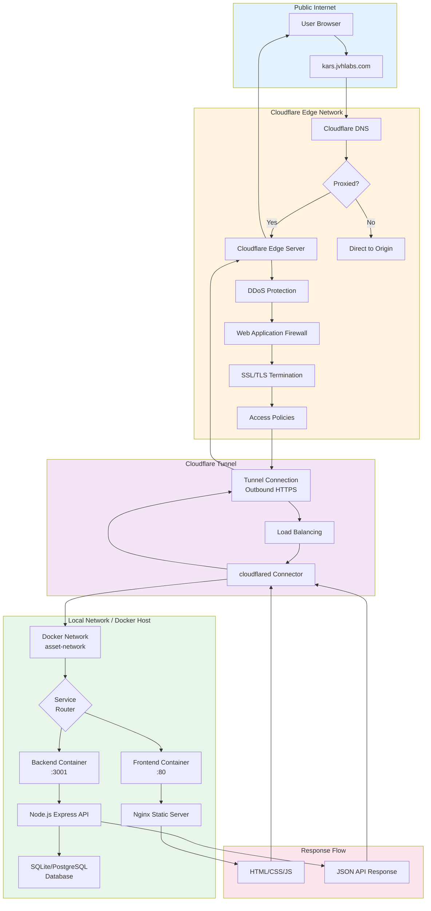

# Cloudflare Tunnel Architecture

This diagram shows how Cloudflare Tunnel provides secure external access to KARS without exposing public IPs or opening firewall ports.

## Tunnel Architecture



## Cloudflare Tunnel Benefits

### Security

✅ **No Public IP Exposure**
- Applications remain behind firewall
- No inbound ports opened
- Reduces attack surface

✅ **Zero Trust Architecture**
- All traffic through Cloudflare edge
- Access policies enforced
- Identity-based access control

✅ **Built-in DDoS Protection**
- Cloudflare's network absorbs attacks
- Rate limiting
- Bot management

✅ **Web Application Firewall (WAF)**
- OWASP Top 10 protection
- Custom rules
- Managed rulesets

### Performance

✅ **Global CDN**
- Content cached at edge
- Reduced latency
- Faster page loads

✅ **Smart Routing**
- Argo Smart Routing (optional)
- Optimal path selection
- Reduced latency

✅ **HTTP/3 Support**
- QUIC protocol
- Faster connection establishment
- Better mobile performance

### Operational

✅ **Automatic SSL/TLS**
- Free SSL certificates
- Automatic renewal
- Multiple TLS versions

✅ **High Availability**
- Multiple cloudflared instances supported
- Automatic failover
- Load balancing

✅ **Easy Management**
- Web dashboard
- CLI tools
- Terraform support

---

## Setup Options

### Option 1: Docker Container (Recommended for Portainer)

**docker-compose.yml:**
```yaml
services:
  cloudflared:
    image: cloudflare/cloudflared:latest
    container_name: cloudflared-tunnel
    restart: unless-stopped
    command: tunnel --no-autoupdate run --token ${CLOUDFLARE_TUNNEL_TOKEN}
    networks:
      - asset-network
    environment:
      - TUNNEL_TOKEN=${CLOUDFLARE_TUNNEL_TOKEN}

networks:
  asset-network:
    external: true
```

**Environment Variables:**
```env
CLOUDFLARE_TUNNEL_TOKEN=<token-from-cloudflare-dashboard>
```

**Start Container:**
```bash
docker-compose up -d cloudflared

# View logs
docker logs -f cloudflared-tunnel
```

---

### Option 2: Cloudflared CLI (Direct on Host)

**Installation:**

**Linux:**
```bash
# Download latest release
wget https://github.com/cloudflare/cloudflared/releases/latest/download/cloudflared-linux-amd64

# Make executable
chmod +x cloudflared-linux-amd64
sudo mv cloudflared-linux-amd64 /usr/local/bin/cloudflared

# Verify installation
cloudflared --version
```

**macOS:**
```bash
brew install cloudflare/cloudflare/cloudflared
```

**Authentication:**
```bash
# Login to Cloudflare
cloudflared tunnel login

# Opens browser for authentication
# Saves credentials to ~/.cloudflared/cert.pem
```

**Create Tunnel:**
```bash
# Create tunnel
cloudflared tunnel create kars-tunnel

# This creates:
# - Tunnel UUID: xxxxxxxx-xxxx-xxxx-xxxx-xxxxxxxxxxxx
# - Credentials file: ~/.cloudflared/xxxxxxxx-xxxx-xxxx-xxxx-xxxxxxxxxxxx.json

# Save tunnel ID for later
echo "Tunnel ID: <tunnel-id>"
```

**Configure Tunnel:**

Create `~/.cloudflared/config.yml`:
```yaml
tunnel: <tunnel-id>
credentials-file: /home/user/.cloudflared/<tunnel-id>.json

ingress:
  # Route to frontend (serves frontend and proxies /api to backend)
  - hostname: kars.jvhlabs.com
    service: http://localhost:8080
  
  # Catch-all rule (required)
  - service: http_status:404
```

**Create DNS Record:**
```bash
# Create CNAME record pointing to tunnel
cloudflared tunnel route dns kars-tunnel kars.jvhlabs.com

# This creates:
# kars.jvhlabs.com CNAME <tunnel-id>.cfargotunnel.com
```

**Run Tunnel:**
```bash
# Run in foreground (testing)
cloudflared tunnel run kars-tunnel

# Run as systemd service (production)
sudo cloudflared service install
sudo systemctl enable cloudflared
sudo systemctl start cloudflared

# Check status
sudo systemctl status cloudflared
```

---

### Option 3: Cloudflare Dashboard (Zero Touch Deployment)

**Steps:**

1. **Navigate to Cloudflare Zero Trust**
   - https://one.dash.cloudflare.com
   - Networks → Tunnels

2. **Create Tunnel**
   - Click "Create a tunnel"
   - Select "Cloudflared"
   - Name: `kars-tunnel`
   - Click "Save tunnel"

3. **Install Connector**
   - Choose deployment method:
     - Docker
     - Linux/macOS/Windows
     - Kubernetes
   - Copy installation command
   - Run on your server

4. **Configure Public Hostname**
   - Subdomain: `kars` (or leave blank for apex)
   - Domain: `jvhlabs.com`
   - Service:
     - Type: HTTP
     - URL: `asset-registration-frontend:80` (Docker) or `localhost:8080` (host)
   - Click "Save hostname"

5. **Additional Settings** (Optional)
   - HTTP Settings:
     - No TLS Verify (if internal services use self-signed certs)
     - HTTP2 Origin
   - TLS Settings:
     - Minimum TLS Version
   - Access Policies:
     - Require login
     - IP restrictions

---

## Configuration Examples

### Basic Configuration (Single Service)

**config.yml:**
```yaml
tunnel: xxxxxxxx-xxxx-xxxx-xxxx-xxxxxxxxxxxx
credentials-file: /path/to/credentials.json

ingress:
  - hostname: kars.jvhlabs.com
    service: http://localhost:8080
  - service: http_status:404
```

### Advanced Configuration (Multiple Services)

**config.yml:**
```yaml
tunnel: xxxxxxxx-xxxx-xxxx-xxxx-xxxxxxxxxxxx
credentials-file: /path/to/credentials.json

# Metrics endpoint (optional)
metrics: localhost:8081

ingress:
  # Main application
  - hostname: kars.jvhlabs.com
    service: http://asset-registration-frontend:80
    originRequest:
      noTLSVerify: true
      connectTimeout: 30s
  
  # API endpoint (direct to backend)
  - hostname: api.kars.jvhlabs.com
    service: http://asset-registration-backend:3001
    originRequest:
      noTLSVerify: true
  
  # Staging environment
  - hostname: staging.kars.jvhlabs.com
    service: http://localhost:8081
  
  # Catch-all
  - service: http_status:404
```

### Load Balancing (Multiple Origins)

**config.yml:**
```yaml
tunnel: xxxxxxxx-xxxx-xxxx-xxxx-xxxxxxxxxxxx
credentials-file: /path/to/credentials.json

ingress:
  - hostname: kars.jvhlabs.com
    service: http://asset-registration-frontend:80
    originRequest:
      # Load balance across multiple instances
      loadBalancer:
        type: random
        pools:
          - http://frontend-1:80
          - http://frontend-2:80
          - http://frontend-3:80
  - service: http_status:404
```

---

## Monitoring

### Tunnel Health

**Check Tunnel Status:**
```bash
# Via CLI
cloudflared tunnel info kars-tunnel

# Expected output:
# NAME         ID                                   CREATED              CONNECTIONS
# kars-tunnel  xxxxxxxx-xxxx-xxxx-xxxx-xxxxxxxxxxxx  2024-12-18T15:00:00Z 4
```

**Check Connections:**
```bash
cloudflared tunnel list

# Shows:
# - Tunnel name
# - ID
# - Creation date
# - Number of active connections
```

**View Logs:**
```bash
# If running as systemd service
journalctl -u cloudflared -f

# If running in Docker
docker logs -f cloudflared-tunnel

# Direct run
cloudflared tunnel run kars-tunnel --loglevel debug
```

### Metrics

**Enable Metrics Endpoint:**

**config.yml:**
```yaml
metrics: localhost:8081
```

**Access Metrics:**
```bash
# Prometheus-compatible metrics
curl http://localhost:8081/metrics

# Key metrics:
# - cloudflared_tunnel_request_latency
# - cloudflared_tunnel_requests_total
# - cloudflared_tunnel_response_by_code
# - cloudflared_tunnel_tcp_connections
```

### Cloudflare Dashboard

**Analytics:**
- Zero Trust → Analytics → Tunnel
- View traffic, requests, errors
- Filter by tunnel, hostname, time range

**Logs:**
- Zero Trust → Logs → Access
- Real-time request logs
- Filter by tunnel, hostname, status code

---

## Security Configuration

### Access Policies

**Require Authentication:**

1. Zero Trust → Access → Applications
2. Add application
3. Configure:
   - Domain: `kars.jvhlabs.com`
   - Policy: Require login
   - Identity providers: Google, GitHub, etc.

**IP Allow/Block Lists:**

1. Zero Trust → Gateway → Firewall Policies
2. Add policy:
   - Action: Allow/Block
   - Source: IP address or range
   - Destination: kars.jvhlabs.com

### TLS Settings

**Minimum TLS Version:**

**config.yml:**
```yaml
ingress:
  - hostname: kars.jvhlabs.com
    service: http://localhost:8080
    originRequest:
      # Origin settings
      noTLSVerify: false  # Verify TLS certificates
      originServerName: localhost
      caPool: /path/to/ca-cert.pem
```

**Cloudflare Dashboard:**
1. SSL/TLS → Edge Certificates
2. Minimum TLS Version: TLS 1.2 or higher

### Rate Limiting

**Configure Rate Limits:**

1. Security → WAF → Rate limiting rules
2. Add rule:
   - Requests: 100 per minute
   - Action: Challenge or Block
   - Apply to: kars.jvhlabs.com

---

## High Availability

### Multiple Connectors

Run multiple `cloudflared` instances for redundancy:

**Docker Compose:**
```yaml
services:
  cloudflared-1:
    image: cloudflare/cloudflared:latest
    command: tunnel --no-autoupdate run --token ${CLOUDFLARE_TUNNEL_TOKEN}
    restart: unless-stopped
    networks:
      - asset-network

  cloudflared-2:
    image: cloudflare/cloudflared:latest
    command: tunnel --no-autoupdate run --token ${CLOUDFLARE_TUNNEL_TOKEN}
    restart: unless-stopped
    networks:
      - asset-network
```

**Benefit:** Automatic failover if one instance fails

### Health Checks

**Docker Health Check:**
```yaml
services:
  cloudflared:
    image: cloudflare/cloudflared:latest
    command: tunnel --no-autoupdate run --token ${CLOUDFLARE_TUNNEL_TOKEN}
    healthcheck:
      test: ["CMD", "cloudflared", "tunnel", "info", "kars-tunnel"]
      interval: 30s
      timeout: 10s
      retries: 3
```

---

## Troubleshooting

### Issue: Tunnel Not Connecting

**Diagnosis:**
```bash
# Check tunnel status
cloudflared tunnel info kars-tunnel

# Check logs
docker logs cloudflared-tunnel
# OR
journalctl -u cloudflared -n 50
```

**Common Causes:**
- Invalid token
- Network connectivity
- Firewall blocking outbound HTTPS

**Solution:**
```bash
# Test network connectivity
curl https://api.cloudflare.com/client/v4/accounts

# Verify token
cloudflared tunnel token <tunnel-id>

# Restart tunnel
docker restart cloudflared-tunnel
# OR
systemctl restart cloudflared
```

### Issue: 502 Bad Gateway

**Diagnosis:**
```bash
# Check origin service
curl http://localhost:8080
curl http://asset-registration-frontend:80

# Check tunnel logs
docker logs cloudflared-tunnel | grep -i error
```

**Common Causes:**
- Origin service down
- Wrong service URL in config
- Network routing issue

**Solution:**
```bash
# Verify origin service running
docker ps | grep asset-registration

# Test origin directly
curl http://localhost:8080/api/health

# Check config.yml service URL
cat ~/.cloudflared/config.yml
```

### Issue: Slow Performance

**Diagnosis:**
```bash
# Check tunnel latency
cloudflared tunnel route ip show

# View metrics
curl http://localhost:8081/metrics | grep latency
```

**Common Causes:**
- Origin server slow
- Network congestion
- Inefficient routing

**Solutions:**
- Enable Argo Smart Routing (paid feature)
- Optimize origin performance
- Add more tunnel replicas
- Enable caching

### Issue: SSL/TLS Errors

**Diagnosis:**
```bash
# Test SSL
openssl s_client -connect kars.jvhlabs.com:443

# Check certificate
curl -vI https://kars.jvhlabs.com
```

**Common Causes:**
- Certificate not provisioned
- DNS not pointing to tunnel
- SSL mode misconfigured

**Solutions:**
```bash
# Verify DNS
dig kars.jvhlabs.com

# Check Cloudflare SSL mode
# Dashboard → SSL/TLS → Overview
# Should be: Full or Full (strict)

# Wait for certificate provisioning (can take 15 minutes)
```

---

## Best Practices

### 1. Use Docker Deployment

Easier management and auto-restart:
```yaml
restart: unless-stopped
```

### 2. Enable Metrics

Monitor tunnel health:
```yaml
metrics: localhost:8081
```

### 3. Run Multiple Instances

High availability:
- 2+ instances for production
- Automatic failover

### 4. Configure Access Policies

Add authentication layer:
- Require login for sensitive paths
- IP restrictions

### 5. Enable Rate Limiting

Protect against abuse:
- Limit requests per IP
- Challenge suspicious traffic

### 6. Regular Updates

Keep `cloudflared` updated:
```bash
docker pull cloudflare/cloudflared:latest
docker-compose up -d
```

---

## Related Documentation

- [CI/CD Overview](ci-cd-overview.md) - Pipeline with Cloudflare
- [Portainer Deployment](portainer-deployment.md) - Cloudflare with Portainer
- [Monitoring & Health Checks](monitoring-health-checks.md) - Monitor tunnel
- [Security Scanning](security-scanning.md) - Security best practices

---

**Last Updated:** December 2024  
**Maintained By:** DevOps Team  
**Cloudflare Account:** jvhlabs.com
