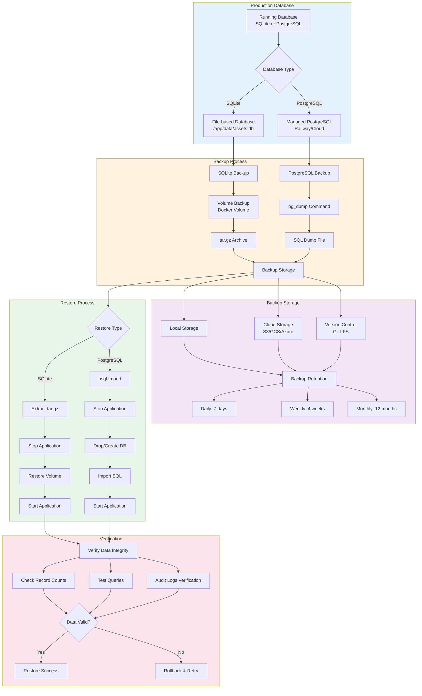

# Database Backup & Restore Workflow

This diagram shows the backup and restore procedures for KARS databases (SQLite and PostgreSQL).

## Backup & Restore Architecture



## SQLite Backup Procedures

### Manual Backup

**Basic Backup:**
```bash
# Backup SQLite database volume
docker run --rm \
  -v asset-data:/data \
  -v $(pwd)/backups:/backup \
  alpine tar czf /backup/asset-data-$(date +%Y%m%d-%H%M%S).tar.gz -C /data .

# Verify backup created
ls -lh backups/asset-data-*.tar.gz
```

**With Metadata:**
```bash
# Create backup with metadata
BACKUP_FILE="backups/asset-data-$(date +%Y%m%d-%H%M%S).tar.gz"
docker run --rm \
  -v asset-data:/data \
  -v $(pwd)/backups:/backup \
  alpine tar czf /backup/$(basename $BACKUP_FILE) -C /data .

# Create metadata file
cat > "${BACKUP_FILE}.meta" <<EOF
Backup Date: $(date -Iseconds)
Database Type: SQLite
Database Size: $(docker run --rm -v asset-data:/data alpine du -sh /data | cut -f1)
Container: asset-registration-backend
Version: $(git describe --tags --always)
EOF

echo "Backup created: $BACKUP_FILE"
```

### Automated Daily Backup

**Backup Script:**

Create `/usr/local/bin/backup-kars-sqlite.sh`:
```bash
#!/bin/bash
set -e

# Configuration
BACKUP_DIR="/var/backups/kars"
RETENTION_DAYS=7
VOLUME_NAME="asset-data"
CONTAINER_NAME="asset-registration-backend"

# Create backup directory
mkdir -p "$BACKUP_DIR"

# Generate backup filename
BACKUP_FILE="$BACKUP_DIR/asset-data-$(date +%Y%m%d-%H%M%S).tar.gz"

# Create backup
echo "Creating backup: $BACKUP_FILE"
docker run --rm \
  -v "$VOLUME_NAME:/data" \
  -v "$BACKUP_DIR:/backup" \
  alpine tar czf "/backup/$(basename $BACKUP_FILE)" -C /data .

# Verify backup
if [ -f "$BACKUP_FILE" ]; then
    echo "Backup created successfully: $(du -h $BACKUP_FILE | cut -f1)"
    
    # Create metadata
    cat > "${BACKUP_FILE}.meta" <<EOF
Backup Date: $(date -Iseconds)
Database Type: SQLite
Database Size: $(docker run --rm -v "$VOLUME_NAME:/data" alpine du -sh /data | cut -f1)
Container: $CONTAINER_NAME
EOF
else
    echo "ERROR: Backup failed!"
    exit 1
fi

# Cleanup old backups
echo "Cleaning up backups older than $RETENTION_DAYS days"
find "$BACKUP_DIR" -name "asset-data-*.tar.gz" -mtime +$RETENTION_DAYS -delete
find "$BACKUP_DIR" -name "asset-data-*.tar.gz.meta" -mtime +$RETENTION_DAYS -delete

echo "Backup complete!"
```

**Make Executable:**
```bash
chmod +x /usr/local/bin/backup-kars-sqlite.sh
```

**Cron Job:**
```bash
# Add to crontab
crontab -e

# Run daily at 2 AM
0 2 * * * /usr/local/bin/backup-kars-sqlite.sh >> /var/log/kars-backup.log 2>&1
```

### SQLite Restore

**Basic Restore:**
```bash
# Stop application
docker-compose down

# Restore volume from backup
docker run --rm \
  -v asset-data:/data \
  -v $(pwd)/backups:/backup \
  alpine sh -c "rm -rf /data/* && tar xzf /backup/asset-data-20241218-020000.tar.gz -C /data"

# Start application
docker-compose up -d

# Verify restoration
docker logs asset-registration-backend | grep -i "database connected"
```

**Restore Script:**

Create `/usr/local/bin/restore-kars-sqlite.sh`:
```bash
#!/bin/bash
set -e

if [ -z "$1" ]; then
    echo "Usage: $0 <backup-file.tar.gz>"
    echo "Available backups:"
    ls -lh /var/backups/kars/asset-data-*.tar.gz
    exit 1
fi

BACKUP_FILE="$1"
VOLUME_NAME="asset-data"

if [ ! -f "$BACKUP_FILE" ]; then
    echo "ERROR: Backup file not found: $BACKUP_FILE"
    exit 1
fi

# Confirm restoration
echo "This will restore database from: $BACKUP_FILE"
echo "WARNING: This will REPLACE all current data!"
read -p "Are you sure? (yes/no): " CONFIRM

if [ "$CONFIRM" != "yes" ]; then
    echo "Restore cancelled."
    exit 0
fi

# Stop application
echo "Stopping application..."
docker-compose down

# Restore volume
echo "Restoring database..."
docker run --rm \
  -v "$VOLUME_NAME:/data" \
  -v "$(dirname $BACKUP_FILE):/backup" \
  alpine sh -c "rm -rf /data/* && tar xzf /backup/$(basename $BACKUP_FILE) -C /data"

# Start application
echo "Starting application..."
docker-compose up -d

# Wait for health check
echo "Waiting for application to be healthy..."
sleep 10

# Verify
if docker ps | grep -q asset-registration-backend; then
    echo "✅ Restore completed successfully!"
    
    # Verify database
    docker exec asset-registration-backend \
      sqlite3 /app/data/assets.db "SELECT COUNT(*) as total_users FROM users;"
else
    echo "❌ ERROR: Application failed to start after restore!"
    exit 1
fi
```

---

## PostgreSQL Backup Procedures

### Manual Backup

**Basic Backup (Railway):**
```bash
# Backup entire database
railway run pg_dump > backup-$(date +%Y%m%d-%H%M%S).sql

# Verify backup
ls -lh backup-*.sql
head -20 backup-*.sql
```

**Compressed Backup:**
```bash
# Compressed backup (saves space)
railway run pg_dump | gzip > backup-$(date +%Y%m%d-%H%M%S).sql.gz

# Backup specific tables only
railway run pg_dump -t users -t assets -t companies > backup-tables-$(date +%Y%m%d).sql
```

**Custom Format Backup (Recommended):**
```bash
# Custom format (faster restore, compression)
railway run pg_dump -Fc > backup-$(date +%Y%m%d).dump

# Benefits:
# - Compressed by default
# - Parallel restore support
# - Selective restore
```

### Automated Daily Backup

**Backup Script for PostgreSQL:**

Create `/usr/local/bin/backup-kars-postgres.sh`:
```bash
#!/bin/bash
set -e

# Configuration
BACKUP_DIR="/var/backups/kars"
RETENTION_DAYS=7
DATABASE_URL="${DATABASE_URL}"

# Create backup directory
mkdir -p "$BACKUP_DIR"

# Generate backup filename
BACKUP_FILE="$BACKUP_DIR/kars-postgres-$(date +%Y%m%d-%H%M%S).sql.gz"

# Create backup
echo "Creating PostgreSQL backup: $BACKUP_FILE"
pg_dump "$DATABASE_URL" | gzip > "$BACKUP_FILE"

# Verify backup
if [ -f "$BACKUP_FILE" ]; then
    echo "Backup created successfully: $(du -h $BACKUP_FILE | cut -f1)"
    
    # Create metadata
    cat > "${BACKUP_FILE}.meta" <<EOF
Backup Date: $(date -Iseconds)
Database Type: PostgreSQL
Database Size: $(psql "$DATABASE_URL" -t -c "SELECT pg_size_pretty(pg_database_size(current_database()));")
Tables: $(psql "$DATABASE_URL" -t -c "SELECT count(*) FROM information_schema.tables WHERE table_schema='public';")
EOF
else
    echo "ERROR: Backup failed!"
    exit 1
fi

# Cleanup old backups
echo "Cleaning up backups older than $RETENTION_DAYS days"
find "$BACKUP_DIR" -name "kars-postgres-*.sql.gz" -mtime +$RETENTION_DAYS -delete
find "$BACKUP_DIR" -name "kars-postgres-*.sql.gz.meta" -mtime +$RETENTION_DAYS -delete

echo "Backup complete!"
```

**Railway Auto-Backups:**

Railway automatically backs up PostgreSQL databases:
- Frequency: Daily
- Retention: 7 days (free tier), longer for paid
- Access: Railway Dashboard → PostgreSQL → Backups
- One-click restore available

### PostgreSQL Restore

**Basic Restore:**
```bash
# Stop application (prevent connections)
railway scale web=0

# Restore database
gunzip < backup-20241218-020000.sql.gz | railway run psql $DATABASE_URL

# Start application
railway scale web=1

# Verify
railway run psql $DATABASE_URL -c "SELECT COUNT(*) FROM users;"
```

**Custom Format Restore:**
```bash
# Restore from custom format
railway run pg_restore -d $DATABASE_URL backup-20241218.dump

# Parallel restore (faster)
railway run pg_restore -d $DATABASE_URL -j 4 backup-20241218.dump

# Selective table restore
railway run pg_restore -d $DATABASE_URL -t users backup-20241218.dump
```

**Restore Script:**

Create `/usr/local/bin/restore-kars-postgres.sh`:
```bash
#!/bin/bash
set -e

if [ -z "$1" ]; then
    echo "Usage: $0 <backup-file.sql.gz>"
    echo "Available backups:"
    ls -lh /var/backups/kars/kars-postgres-*.sql.gz
    exit 1
fi

BACKUP_FILE="$1"
DATABASE_URL="${DATABASE_URL}"

if [ ! -f "$BACKUP_FILE" ]; then
    echo "ERROR: Backup file not found: $BACKUP_FILE"
    exit 1
fi

# Confirm restoration
echo "This will restore database from: $BACKUP_FILE"
echo "WARNING: This will REPLACE all current data!"
read -p "Are you sure? (yes/no): " CONFIRM

if [ "$CONFIRM" != "yes" ]; then
    echo "Restore cancelled."
    exit 0
fi

# Stop application
echo "Stopping application..."
railway scale web=0

# Drop and recreate database (optional, for clean restore)
echo "Dropping and recreating database..."
railway run psql $DATABASE_URL -c "DROP SCHEMA public CASCADE; CREATE SCHEMA public;"

# Restore database
echo "Restoring database..."
gunzip < "$BACKUP_FILE" | railway run psql $DATABASE_URL

# Start application
echo "Starting application..."
railway scale web=1

# Wait for health check
echo "Waiting for application to be healthy..."
sleep 15

# Verify
echo "Verifying restore..."
railway run psql $DATABASE_URL -c "\
  SELECT 'users' as table, COUNT(*) FROM users \
  UNION ALL \
  SELECT 'assets', COUNT(*) FROM assets \
  UNION ALL \
  SELECT 'companies', COUNT(*) FROM companies;"

echo "✅ Restore completed successfully!"
```

---

## Backup Storage Options

### Local Storage

**Pros:**
- Fast backup/restore
- No external dependencies
- No additional cost

**Cons:**
- Risk of data loss (same host)
- Manual management
- Limited scalability

**Setup:**
```bash
# Create backup directory
mkdir -p /var/backups/kars
chmod 700 /var/backups/kars
```

### Cloud Storage (S3/GCS/Azure)

**Pros:**
- Off-site redundancy
- Automatic retention
- Scalable storage

**Cons:**
- Additional cost
- Requires cloud account
- Network dependency

**S3 Example:**
```bash
# Install AWS CLI
apt-get install awscli

# Configure AWS credentials
aws configure

# Upload backup
aws s3 cp backup-20241218.tar.gz s3://my-kars-backups/

# List backups
aws s3 ls s3://my-kars-backups/

# Download backup
aws s3 cp s3://my-kars-backups/backup-20241218.tar.gz .
```

**Automated S3 Backup:**
```bash
# Add to backup script
aws s3 cp "$BACKUP_FILE" "s3://my-kars-backups/$(basename $BACKUP_FILE)"

# Set lifecycle policy (delete after 30 days)
aws s3api put-bucket-lifecycle-configuration \
  --bucket my-kars-backups \
  --lifecycle-configuration file://lifecycle.json
```

### Git LFS (Large File Storage)

**Pros:**
- Version control for backups
- Easy collaboration
- GitHub/GitLab integration

**Cons:**
- Storage limits
- Not ideal for very large databases
- Requires Git LFS setup

**Setup:**
```bash
# Install Git LFS
git lfs install

# Track backup files
git lfs track "*.tar.gz"
git lfs track "*.sql.gz"

# Commit and push
git add backups/
git commit -m "Add backup $(date +%Y%m%d)"
git push
```

---

## Backup Retention Policy

### Recommended Retention

| Backup Type | Frequency | Retention | Storage |
|-------------|-----------|-----------|---------|
| **Daily** | Every day | 7 days | Local |
| **Weekly** | Sunday | 4 weeks | Local + Cloud |
| **Monthly** | 1st of month | 12 months | Cloud only |
| **Yearly** | Jan 1st | Forever | Cloud only |

### Implementation

**Retention Script:**
```bash
#!/bin/bash

BACKUP_DIR="/var/backups/kars"

# Daily: Keep 7 days
find "$BACKUP_DIR/daily" -name "*.tar.gz" -mtime +7 -delete

# Weekly: Keep 4 weeks
find "$BACKUP_DIR/weekly" -name "*.tar.gz" -mtime +28 -delete

# Monthly: Keep 12 months
find "$BACKUP_DIR/monthly" -name "*.tar.gz" -mtime +365 -delete

# Yearly: Never delete
# (stored in separate directory)
```

---

## Disaster Recovery

### Recovery Time Objective (RTO)

**Target:** < 1 hour

**Procedure:**
1. Identify last good backup (5 minutes)
2. Provision new infrastructure (10 minutes)
3. Restore database (20 minutes)
4. Verify and test (15 minutes)
5. Switch DNS (5 minutes)

### Recovery Point Objective (RPO)

**Target:** < 24 hours

**Strategy:**
- Daily backups at 2 AM
- Maximum data loss: 24 hours
- Consider more frequent backups for critical periods

### Disaster Recovery Plan

**Complete Infrastructure Loss:**

1. **Provision New Infrastructure**
   ```bash
   # Deploy to new Railway project
   railway up
   
   # Or new Portainer stack
   docker-compose up -d
   ```

2. **Restore Latest Backup**
   ```bash
   # Download from S3
   aws s3 cp s3://my-kars-backups/latest-backup.sql.gz .
   
   # Restore database
   ./restore-kars-postgres.sh latest-backup.sql.gz
   ```

3. **Update DNS**
   ```bash
   # Update Cloudflare DNS to new IP/CNAME
   cloudflare-cli dns update kars.jvhlabs.com --to new-cname
   ```

4. **Verify Services**
   ```bash
   curl https://kars.jvhlabs.com/api/health
   ```

---

## Best Practices

### 1. Test Restores Regularly

**Monthly Restore Test:**
```bash
# Restore to test environment
./restore-kars-sqlite.sh backup-latest.tar.gz

# Verify data
docker exec asset-registration-backend \
  sqlite3 /app/data/assets.db "SELECT COUNT(*) FROM assets;"

# Document test results
```

### 2. Automate Backups

- Use cron for scheduled backups
- Monitor backup success/failure
- Alert on backup failures

### 3. Encrypt Backups

**Encrypt Sensitive Data:**
```bash
# Encrypt backup
gpg --encrypt --recipient admin@example.com backup-20241218.tar.gz

# Decrypt backup
gpg --decrypt backup-20241218.tar.gz.gpg > backup-20241218.tar.gz
```

### 4. Off-Site Storage

- Always store backups off-site (cloud)
- Use at least 2 storage locations
- Test restore from cloud regularly

### 5. Document Procedures

- Keep restore procedures up-to-date
- Document all backup locations
- Maintain recovery contact list

---

## Verification

### Database Integrity Check

**SQLite:**
```bash
docker exec asset-registration-backend \
  sqlite3 /app/data/assets.db "PRAGMA integrity_check;"

# Expected: ok
```

**PostgreSQL:**
```bash
railway run psql $DATABASE_URL -c "SELECT * FROM pg_stat_database_conflicts;"

# Check for data corruption
railway run psql $DATABASE_URL -c "REINDEX DATABASE railway;"
```

### Record Count Verification

```bash
# Check record counts
railway run psql $DATABASE_URL -c "\
  SELECT 'users' as table, COUNT(*) FROM users \
  UNION ALL \
  SELECT 'assets', COUNT(*) FROM assets \
  UNION ALL \
  SELECT 'companies', COUNT(*) FROM companies \
  UNION ALL \
  SELECT 'audit_logs', COUNT(*) FROM audit_logs;"
```

---

## Related Documentation

- [Portainer Deployment](portainer-deployment.md) - SQLite backups
- [Railway Deployment](railway-deployment.md) - PostgreSQL backups
- [Incident Response](../INCIDENT-RESPONSE.md) - Data loss scenarios
- [Release Checklist](../RELEASE-CHECKLIST.md) - Pre-release backups

---

**Last Updated:** December 2024  
**Maintained By:** DevOps Team
