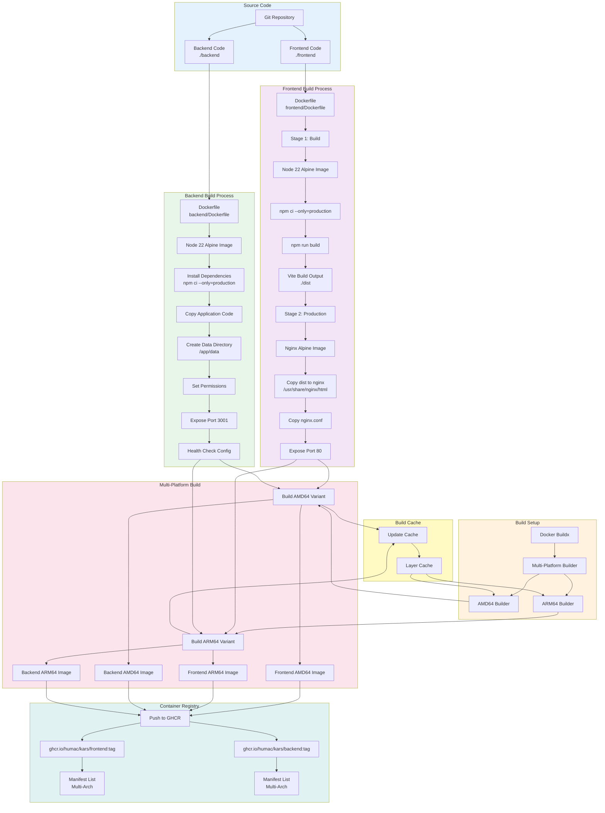

# Docker Build Process

This diagram shows the multi-platform Docker build process for KARS frontend and backend containers.

## Multi-Platform Build Architecture



## Frontend Dockerfile

### Multi-Stage Build

**Stage 1: Build Stage**
```dockerfile
FROM node:22-alpine AS build
WORKDIR /app
COPY package*.json ./
RUN npm ci --only=production
COPY . .
RUN npm run build
```

**Purpose:** Compile React application with Vite

**Output:** Static files in `./dist` directory

**Stage 2: Production Stage**
```dockerfile
FROM nginx:alpine
COPY --from=build /app/dist /usr/share/nginx/html
COPY nginx.conf /etc/nginx/conf.d/default.conf
EXPOSE 80
CMD ["nginx", "-g", "daemon off;"]
```

**Purpose:** Serve static files with Nginx

**Size:** ~25 MB (optimized with Alpine)

### Build Command

```bash
docker buildx build \
  --platform linux/amd64,linux/arm64 \
  --file ./frontend/Dockerfile \
  --tag ghcr.io/humac/kars/frontend:develop \
  --push \
  ./frontend
```

---

## Backend Dockerfile

### Single-Stage Build

```dockerfile
FROM node:22-alpine

WORKDIR /app

# Copy package files
COPY package*.json ./

# Install production dependencies
RUN npm ci --only=production

# Copy application code
COPY . .

# Create data directory for SQLite
RUN mkdir -p /app/data && \
    chown -R node:node /app/data

# Use non-root user
USER node

# Expose API port
EXPOSE 3001

# Health check
HEALTHCHECK --interval=30s --timeout=5s --start-period=10s --retries=3 \
  CMD node -e "require('http').get('http://localhost:3001/api/health', (r) => process.exit(r.statusCode === 200 ? 0 : 1))"

# Start application
CMD ["node", "server.js"]
```

**Size:** ~200 MB (includes Node.js and native modules)

### Build Command

```bash
docker buildx build \
  --platform linux/amd64,linux/arm64 \
  --file ./backend/Dockerfile \
  --tag ghcr.io/humac/kars/backend:develop \
  --push \
  ./backend
```

---

## Multi-Platform Support

### Supported Platforms

| Platform | Architecture | Use Cases |
|----------|--------------|-----------|
| **linux/amd64** | x86_64 (Intel/AMD) | Servers, cloud VMs, desktop development |
| **linux/arm64** | ARM64 (aarch64) | Raspberry Pi, AWS Graviton, Apple Silicon |

### Docker Buildx

**Setup:**
```bash
# Create builder instance
docker buildx create --name multiarch --use

# Inspect builder
docker buildx inspect --bootstrap

# List supported platforms
docker buildx inspect multiarch | grep Platforms
```

**Build for Multiple Platforms:**
```bash
docker buildx build \
  --platform linux/amd64,linux/arm64 \
  --tag myimage:latest \
  --push \
  .
```

### Manifest Lists

Docker automatically creates manifest lists for multi-platform images:

```bash
# View manifest
docker manifest inspect ghcr.io/humac/kars/frontend:develop
```

**Example Output:**
```json
{
  "manifests": [
    {
      "platform": {
        "architecture": "amd64",
        "os": "linux"
      }
    },
    {
      "platform": {
        "architecture": "arm64",
        "os": "linux"
      }
    }
  ]
}
```

**Benefit:** Docker automatically pulls the correct image for the host platform

---

## Build Optimization

### Layer Caching

**Strategy:**
1. Copy package files first
2. Install dependencies (cached layer)
3. Copy application code (changes frequently)

**Frontend Example:**
```dockerfile
# Cached layer (changes rarely)
COPY package*.json ./
RUN npm ci --only=production

# Frequent changes
COPY . .
RUN npm run build
```

**Benefit:** Dependencies only reinstalled when `package*.json` changes

### Registry Cache

**GitHub Actions Configuration:**
```yaml
- uses: docker/build-push-action@v5
  with:
    cache-from: type=registry,ref=ghcr.io/humac/kars/frontend:buildcache
    cache-to: type=registry,ref=ghcr.io/humac/kars/frontend:buildcache,mode=max
```

**Benefit:** ~50% faster builds using layer cache from previous builds

### Multi-Stage Builds (Frontend)

**Benefit:** Smaller production images

| Stage | Size | Purpose |
|-------|------|---------|
| **Build** | ~500 MB | Compile application |
| **Production** | ~25 MB | Serve static files |

**Size Reduction:** 95% smaller production image

---

## Build Process Workflow

### Local Development Build

```bash
# Build frontend locally
cd frontend
docker build -t kars-frontend:local .

# Build backend locally
cd backend
docker build -t kars-backend:local .

# Test locally
docker run -p 3000:80 kars-frontend:local
docker run -p 3001:3001 -e JWT_SECRET=test kars-backend:local
```

### CI/CD Build (GitHub Actions)

```yaml
- name: Build and push frontend image
  uses: docker/build-push-action@v5
  with:
    context: ./frontend
    file: ./frontend/Dockerfile
    push: true
    platforms: linux/amd64,linux/arm64
    tags: |
      ghcr.io/humac/kars/frontend:develop
      ghcr.io/humac/kars/frontend:develop-${{ github.sha }}
    cache-from: type=registry,ref=ghcr.io/humac/kars/frontend:buildcache
    cache-to: type=registry,ref=ghcr.io/humac/kars/frontend:buildcache,mode=max
```

**Build Time:**
- First build: ~8-12 minutes (multi-platform)
- Cached build: ~4-6 minutes (50% faster)

---

## Image Tags

### Tagging Strategy

| Tag Pattern | Example | Purpose |
|-------------|---------|---------|
| `branch` | `develop` | Latest from branch |
| `branch-sha` | `develop-sha-abc123` | Specific commit |
| `latest` | `latest` | Latest stable (main only) |
| `v1.x.x` | `v1.2.3` | Release version |

### Tag Metadata

**GitHub Actions Metadata Action:**
```yaml
- uses: docker/metadata-action@v5
  with:
    images: ghcr.io/humac/kars/frontend
    tags: |
      type=ref,event=branch
      type=sha,prefix={{branch}}-
      type=raw,value=latest,enable={{is_default_branch}}
      type=semver,pattern={{version}}
```

---

## Health Checks

### Backend Health Check

**Dockerfile Configuration:**
```dockerfile
HEALTHCHECK --interval=30s --timeout=5s --start-period=10s --retries=3 \
  CMD node -e "require('http').get('http://localhost:3001/api/health', (r) => process.exit(r.statusCode === 200 ? 0 : 1))"
```

**Parameters:**
- `interval=30s` - Check every 30 seconds
- `timeout=5s` - Fail if no response in 5 seconds
- `start-period=10s` - Grace period on startup
- `retries=3` - Mark unhealthy after 3 failures

**Endpoint:** `GET /api/health`

**Expected Response:**
```json
{
  "status": "ok",
  "timestamp": "2024-12-18T15:30:00.000Z"
}
```

### Frontend Health Check

**Nginx Default:** HTTP 200 on port 80

**Custom Check:**
```bash
curl -f http://localhost:80 || exit 1
```

---

## Security Considerations

### Base Images

**Node.js:**
- Use official `node:22-alpine` image
- Alpine Linux for smaller size and fewer vulnerabilities
- Regular updates via Dependabot

**Nginx:**
- Use official `nginx:alpine` image
- Minimal attack surface
- Regular security updates

### Non-Root User

**Backend runs as `node` user (not root):**
```dockerfile
USER node
```

**Security Benefit:** Limits potential damage from container compromise

### Dependency Scanning

**npm audit:** Runs in CI on every build
```bash
npm audit --audit-level=high
```

**Container Scanning:** GitHub Container Registry auto-scans pushed images

---

## Troubleshooting

### Build Failures

#### Issue: npm install fails

**Symptom:**
```
ERROR: failed to fetch metadata
```

**Solution:**
```bash
# Clear npm cache
docker buildx build --no-cache ...

# Check package-lock.json is committed
git ls-files | grep package-lock.json
```

#### Issue: Multi-platform build slow

**Symptom:** Build takes >20 minutes

**Solutions:**
- Enable and use build cache
- Use `--cache-from` and `--cache-to`
- Build platforms separately if needed

#### Issue: ARM64 build fails but AMD64 succeeds

**Symptom:** Native module build error on ARM64

**Cause:** Some native modules (better-sqlite3) require platform-specific builds

**Solution:**
```dockerfile
# Ensure Node.js version supports both platforms
FROM node:22-alpine

# Native modules will build for target platform
RUN npm ci --only=production
```

### Image Size Issues

```bash
# Analyze image layers
docker history ghcr.io/humac/kars/backend:develop

# Find large files
docker run --rm ghcr.io/humac/kars/backend:develop du -sh /* 2>/dev/null | sort -h

# Optimize:
# 1. Use .dockerignore
# 2. Multi-stage builds
# 3. Clean up in same RUN command
```

---

## Related Documentation

- [CI/CD Overview](ci-cd-overview.md) - Pipeline architecture
- [GitHub Actions Workflow](github-actions-workflow.md) - Workflow details
- [Portainer Deployment](portainer-deployment.md) - Using built images
- [Railway Deployment](railway-deployment.md) - Railway builds

---

**Last Updated:** December 2024  
**Maintained By:** DevOps Team
