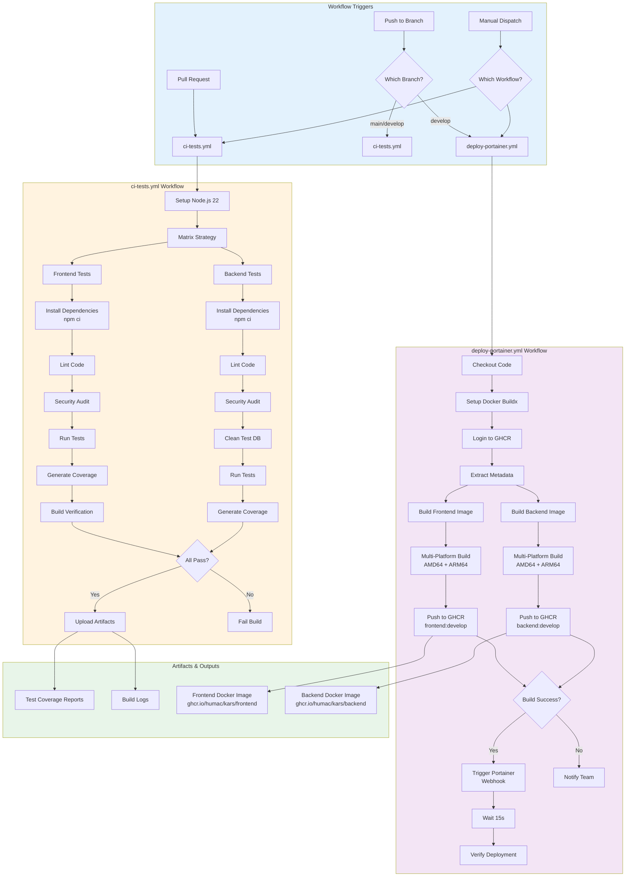

# GitHub Actions Workflow

This diagram details the GitHub Actions workflows that power KARS CI/CD pipeline.

## Workflow Architecture



## Workflow Files

### 1. ci-tests.yml

**Purpose:** Run automated tests on all PRs and pushes to main/develop

**Triggers:**
- All pull requests
- Push to `main` or `develop` (when code changes)
- Manual workflow dispatch

**Jobs:**

#### Test Job (Matrix Strategy)
```yaml
strategy:
  matrix:
    project: [frontend, backend]
```

**Steps for Each Project:**

1. **Checkout Code**
   - Uses: `actions/checkout@v4`
   - Action: Clone repository

2. **Setup Node.js**
   - Uses: `actions/setup-node@v4`
   - Version: Node.js 22 LTS
   - Cache: npm dependencies

3. **Install Dependencies**
   ```bash
   npm ci  # Clean install from package-lock.json
   ```

4. **Lint Code**
   ```bash
   npm run lint --if-present
   ```

5. **Security Audit**
   ```bash
   npm audit --audit-level=high
   ```
   - Continues on error (non-blocking)

6. **Clean Test Environment** (Backend only)
   ```bash
   rm -f data/*.db data/*.db-journal data/*.db-wal data/*.db-shm
   ```

7. **Run Tests**
   ```bash
   npm test
   ```
   - Environment: `NODE_ENV=test`, `CI=true`
   - Backend gets `JWT_SECRET=test-jwt-secret-for-ci-only`

8. **Generate Coverage**
   ```bash
   npm run test:coverage --if-present
   ```

9. **Build Verification** (Frontend only)
   ```bash
   npm run build
   ```

10. **Upload Artifacts**
    - Coverage reports
    - Test results

**Success Criteria:**
- All tests pass
- No high/critical security vulnerabilities
- Build successful (frontend)

**Duration:** ~5-8 minutes

---

### 2. deploy-portainer.yml

**Purpose:** Build Docker images and deploy to staging (Portainer)

**Triggers:**
- Push to `develop` branch (automatic)
- Manual workflow dispatch

**Jobs:**

#### Build and Push Job

**Steps:**

1. **Checkout Repository**
   - Uses: `actions/checkout@v4`

2. **Setup Docker Buildx**
   - Uses: `docker/setup-buildx-action@v3`
   - Enables multi-platform builds

3. **Login to GitHub Container Registry**
   - Uses: `docker/login-action@v3`
   - Registry: `ghcr.io`
   - Credentials: `GITHUB_TOKEN`

4. **Extract Metadata (Frontend)**
   - Uses: `docker/metadata-action@v5`
   - Tags:
     - `type=ref,event=branch` → `develop`
     - `type=sha,prefix={{branch}}-` → `develop-sha-abc123`
     - `type=raw,value=latest` (if default branch)

5. **Build and Push Frontend Image**
   - Uses: `docker/build-push-action@v5`
   - Context: `./frontend`
   - Dockerfile: `./frontend/Dockerfile`
   - Platforms: `linux/amd64,linux/arm64`
   - Cache: Registry cache for faster builds

6. **Extract Metadata (Backend)**
   - Same as frontend metadata

7. **Build and Push Backend Image**
   - Uses: `docker/build-push-action@v5`
   - Context: `./backend`
   - Dockerfile: `./backend/Dockerfile`
   - Platforms: `linux/amd64,linux/arm64`
   - Cache: Registry cache for faster builds

**Build Time:** ~8-12 minutes (multi-platform)

#### Deploy to Staging Job

**Dependencies:** Requires build-and-push job to succeed

**Environment:** `staging` (with approval rules)

**Steps:**

1. **Deploy to Portainer**
   ```bash
   curl -X POST "$PORTAINER_WEBHOOK_URL"
   ```
   - Webhook configured with `pullImage=true`
   - Triggers Portainer to pull latest images and restart

2. **Wait for Deployment**
   ```bash
   sleep 15
   ```
   - Allows time for Portainer to pull and restart

3. **Verify Deployment**
   - Logs deployment status
   - Check Portainer for container health

**Deploy Time:** ~3-5 minutes

---

### 3. verify-files.yml

**Purpose:** Validate that critical files exist and are complete

**Triggers:**
- Pull requests
- Push to main/develop

**Checks:**
- Required markdown files exist
- Configuration files present
- Docker files valid
- Package.json files valid

---

### 4. wiki-sync.yml

**Purpose:** Sync documentation to GitHub Wiki

**Triggers:**
- Push to main (when wiki files change)

**Actions:**
- Copy wiki markdown files
- Push to wiki repository
- Update wiki navigation

---

## Environment Variables & Secrets

### GitHub Secrets (Required)

| Secret | Purpose | Where Used |
|--------|---------|------------|
| `GITHUB_TOKEN` | GitHub API access | All workflows (auto-provided) |
| `PORTAINER_WEBHOOK_URL` | Staging deployment | deploy-portainer.yml |
| `GHCR_TOKEN` | Container registry | deploy-portainer.yml (optional) |

### Environment Variables

| Variable | Value | Purpose |
|----------|-------|---------|
| `REGISTRY` | ghcr.io | Container registry URL |
| `NODE_ENV` | test | Test environment |
| `CI` | true | Indicates CI environment |
| `JWT_SECRET` | test-jwt-secret-for-ci-only | Test JWT signing |

---

## Workflow Optimization

### Concurrency Control

```yaml
concurrency:
  group: ${{ github.workflow }}-${{ github.ref }}
  cancel-in-progress: true
```

**Benefit:** Cancels redundant builds when new commits pushed

### Caching

```yaml
- uses: actions/setup-node@v4
  with:
    cache: 'npm'
    cache-dependency-path: ${{ matrix.project }}/package-lock.json
```

**Benefit:** Faster dependency installation (~30-60 seconds saved)

### Docker Build Cache

```yaml
cache-from: type=registry,ref=${{ env.REGISTRY }}/${{ env.IMAGE_NAME }}:buildcache
cache-to: type=registry,ref=${{ env.REGISTRY }}/${{ env.IMAGE_NAME }}:buildcache,mode=max
```

**Benefit:** Faster Docker builds using layer caching (~50% time reduction)

### Matrix Strategy

```yaml
strategy:
  fail-fast: false
  matrix:
    project: [frontend, backend]
```

**Benefit:** Parallel test execution, faster feedback

---

## Workflow Monitoring

### GitHub Actions UI

View workflow runs:
```
https://github.com/humac/kars/actions
```

### Check Status via CLI

```bash
# List recent workflow runs
gh run list

# View specific run
gh run view <run-id>

# Watch workflow in real-time
gh run watch

# View logs
gh run view <run-id> --log
```

### Status Badges

Add to README.md:
```markdown
[](https://github.com/humac/kars/actions/workflows/ci-tests.yml)
```

---

## Troubleshooting

### Common Issues

#### Issue: Tests Failing in CI but Pass Locally

**Causes:**
- Node version mismatch (must be 22 LTS)
- Environment variables missing
- Test database not cleaned

**Solutions:**
```bash
# Use same Node version locally
nvm use 22

# Set CI environment variable
CI=true npm test

# Clean test databases
rm -f backend/data/*.db*
```

#### Issue: Docker Build Timeout

**Causes:**
- Large dependencies
- Network issues
- No build cache

**Solutions:**
- Enable and use Docker build cache
- Reduce image size
- Split long-running operations

#### Issue: Portainer Webhook Not Pulling Images

**Causes:**
- Webhook not configured with `pullImage=true`
- Images not public and no registry auth
- Network connectivity issue

**Solutions:**
```bash
# Test webhook manually
curl -X POST "$PORTAINER_WEBHOOK_URL"

# Verify webhook settings in Portainer
# Ensure "Pull latest image version" is checked

# Make images public or add registry auth
```

---

## Related Documentation

- [CI/CD Overview](ci-cd-overview.md) - High-level pipeline architecture
- [Docker Build Process](docker-build-process.md) - Docker build details
- [Portainer Deployment](portainer-deployment.md) - Staging deployment
- [Security Scanning](security-scanning.md) - Security checks

---

**Last Updated:** December 2024  
**Maintained By:** DevOps Team
