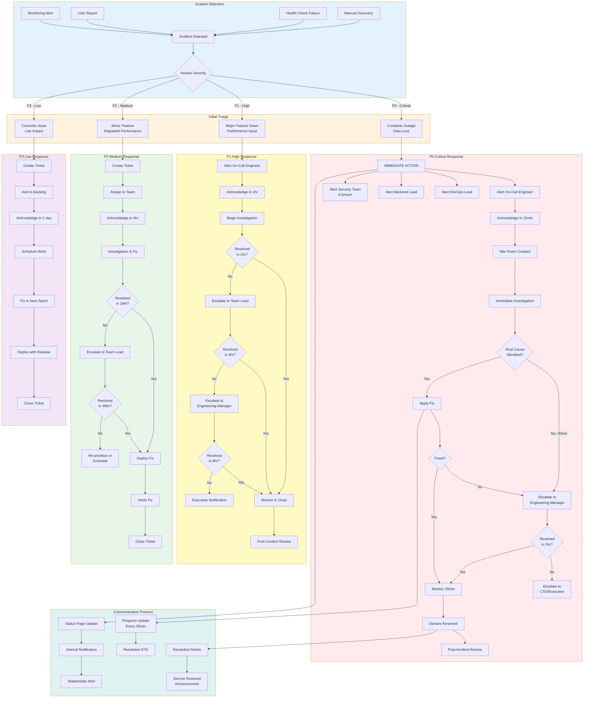

# Incident Escalation Flow

This diagram shows the incident escalation process for KARS, from detection to resolution.

## Escalation Flowchart



## Escalation Matrix

### Response Time SLAs

| Severity | Response Time | Resolution Target | Escalation Trigger |
|----------|---------------|-------------------|-------------------|
| **P0 - Critical** | 15 minutes | 2 hours | Immediate to all leads |
| **P1 - High** | 1 hour | 8 hours | After 2 hours if unresolved |
| **P2 - Medium** | 4 hours | 48 hours | After 24 hours if unresolved |
| **P3 - Low** | 1 business day | 1 week | Not required |

### Escalation Paths

#### P0 - Critical Incidents

```
┌─────────────────────────────────────────────────────────────┐
│                    P0 INCIDENT DETECTED                      │
│                   (Complete Service Outage)                  │
└────────────────────────┬────────────────────────────────────┘
                         │
              ┌──────────┴──────────┐
              │   IMMEDIATE ALERT   │
              │    (0-15 minutes)   │
              └──────────┬──────────┘
                         │
         ┌───────────────┼───────────────┐
         │               │               │
         ▼               ▼               ▼
┌─────────────────┐ ┌──────────────┐ ┌──────────────┐
│  On-Call        │ │ DevOps Lead  │ │ Backend Lead │
│  Engineer       │ │              │ │              │
│  (Primary)      │ │              │ │              │
└────────┬────────┘ └──────┬───────┘ └──────┬───────┘
         │                 │                 │
         └─────────────────┴─────────────────┘
                           │
                  If unresolved after 2 hours
                           │
                           ▼
              ┌─────────────────────────┐
              │  Engineering Manager    │
              │  (Cross-team coord)     │
              └────────────┬────────────┘
                           │
                  If unresolved after 4 hours
                           │
                           ▼
              ┌─────────────────────────┐
              │  CTO / Executive Team   │
              │  (Business decisions)   │
              └─────────────────────────┘
```

#### P1 - High Priority Incidents

```
┌─────────────────────────────────────────────────────────────┐
│                    P1 INCIDENT DETECTED                      │
│              (Major Feature Unavailable)                     │
└────────────────────────┬────────────────────────────────────┘
                         │
              ┌──────────┴──────────┐
              │   ALERT ON-CALL     │
              │    (within 1 hour)  │
              └──────────┬──────────┘
                         │
                         ▼
              ┌─────────────────────┐
              │   On-Call Engineer  │
              │   (Primary Response)│
              └──────────┬──────────┘
                         │
                If unresolved after 2 hours
                         │
                         ▼
              ┌─────────────────────┐
              │ Appropriate Lead    │
              │ (Domain expert)     │
              └──────────┬──────────┘
                         │
                If unresolved after 4 hours
                         │
                         ▼
              ┌─────────────────────┐
              │ Engineering Manager │
              └─────────────────────┘
```

---

## Severity Definitions

### P0 - Critical

**Definition:** Complete service outage or critical data loss affecting all users.

**Examples:**
- Application completely inaccessible
- Database corruption or significant data loss
- Security breach or data leak
- Authentication system completely down
- Complete loss of service for all users

**Response Actions:**
1. Immediate alert to all relevant team leads
2. Create war room (video call/chat)
3. Provide status updates every 30 minutes
4. All hands on deck until resolved
5. Executive notification if >2 hours

**Communication:**
- Internal: Immediate notification
- External: Status page update within 15 minutes
- Stakeholders: Email within 30 minutes

---

### P1 - High

**Definition:** Major functionality impaired but service partially accessible.

**Examples:**
- Asset registration not working
- Login failures for subset of users
- Admin functions unavailable
- Database performance severely degraded
- Email notifications failing
- Critical API endpoints returning errors

**Response Actions:**
1. Alert on-call engineer
2. Begin investigation within 1 hour
3. Escalate to team lead if unresolved after 2 hours
4. Provide status updates every hour
5. Consider workarounds or rollback

**Communication:**
- Internal: Notification within 1 hour
- External: Status page update if >2 hours
- Stakeholders: Email if >4 hours

---

### P2 - Medium

**Definition:** Service operational but degraded performance or non-critical features unavailable.

**Examples:**
- Slow page load times (>5 seconds)
- Intermittent errors on specific features
- CSV export failures
- MFA enrollment issues
- Search functionality slow
- Minor UI bugs affecting usability

**Response Actions:**
1. Create ticket and assign to appropriate team
2. Acknowledge within 4 hours
3. Investigation and fix within 24 hours
4. Escalate to team lead if unresolved after 24 hours
5. Schedule fix for next deployment

**Communication:**
- Internal: Ticket creation
- External: Not required unless prolonged
- Stakeholders: Update if escalated

---

### P3 - Low

**Definition:** Cosmetic issues or minor inconveniences with workarounds available.

**Examples:**
- UI display issues
- Typos in error messages
- Minor documentation errors
- Non-critical feature requests
- Aesthetic improvements

**Response Actions:**
1. Create ticket and add to backlog
2. Acknowledge within 1 business day
3. Schedule for future sprint
4. Fix with normal release cycle

**Communication:**
- Internal: Ticket only
- External: Not required
- Stakeholders: Not required

---

## Communication Templates

### P0 Initial Alert

```
🚨 P0 INCIDENT - CRITICAL

Incident ID: INC-20241218-001
Time: 2024-12-18 15:30:00 UTC
Severity: P0 - Critical
Impact: Complete service outage

Description:
Application is completely inaccessible. All users affected.

Status: INVESTIGATING

Assigned: On-Call Engineer (@oncall)
War Room: https://meet.google.com/xxx-xxxx-xxx

Updates will be provided every 30 minutes.

DO NOT REPLY - Use war room for coordination.
```

### P0 Progress Update

```
🔄 P0 INCIDENT UPDATE - INC-20241218-001

Time: 2024-12-18 16:00:00 UTC (30 minutes elapsed)
Status: ROOT CAUSE IDENTIFIED

Progress:
✅ Database connection issue identified
✅ Fix applied to staging
⏳ Deploying fix to production

Next Steps:
- Deploy fix (ETA: 5 minutes)
- Monitor for stability (15 minutes)
- Verify all services operational

ETA to Resolution: 20 minutes
Impact: All users still affected

Next update: 16:30 UTC or when resolved
```

### P0 Resolution Notice

```
✅ P0 INCIDENT RESOLVED - INC-20241218-001

Resolution Time: 2024-12-18 16:15:00 UTC
Duration: 45 minutes
Severity: P0 - Critical

Summary:
Service outage caused by database connection pool exhaustion.
All services now operational.

Resolution:
- Increased connection pool size
- Restarted application services
- Verified all functionality working

Verification:
✅ Health checks passing
✅ User logins working
✅ Asset management functional
✅ All APIs responding normally

Impact:
All users affected for 45 minutes. No data loss.

Next Steps:
- Post-incident review scheduled for 2024-12-19 10:00 UTC
- Implementing additional monitoring
- Connection pool tuning

Thank you for your patience.
```

---

## On-Call Rotation

### On-Call Schedule

**Rotation:** Weekly (Monday 00:00 UTC to Monday 00:00 UTC)

**Responsibilities:**
- Primary responder for all incidents
- Available 24/7 during on-call week
- Response within SLA timeframes
- Escalate when necessary

**On-Call Compensation:**
- On-call stipend per week
- Overtime pay for incident response
- Compensatory time off after major incidents

### On-Call Handoff

**Monday Morning Handoff Call:**

1. Review open incidents
2. Review scheduled maintenance
3. Review known issues
4. Share access credentials
5. Test paging system

**Handoff Checklist:**
- [ ] Access to PagerDuty
- [ ] Access to Railway/Portainer
- [ ] Access to GitHub
- [ ] Access to Slack/communication channels
- [ ] Emergency contact list updated
- [ ] Runbook access verified
- [ ] Test page sent and acknowledged

---

## War Room Protocol

### When to Create War Room

- All P0 incidents (immediately)
- P1 incidents if escalated to manager
- Any security incident
- Multiple concurrent incidents

### War Room Setup

**Platform:** Google Meet / Zoom / Slack Huddle

**Participants:**
- On-Call Engineer (facilitator)
- Relevant team leads
- Engineering Manager (for P0)
- Subject matter experts

**Structure:**
1. **Initial Assessment** (5 minutes)
   - What's broken?
   - What's the impact?
   - What's the timeline?

2. **Investigation** (ongoing)
   - Assign tasks
   - Share findings
   - Test hypotheses

3. **Resolution** (ongoing)
   - Apply fixes
   - Test fixes
   - Deploy fixes

4. **Verification** (15-30 minutes)
   - Confirm resolution
   - Monitor for issues
   - Gather metrics

5. **Wrap-up** (10 minutes)
   - Document timeline
   - Schedule post-mortem
   - Thank participants

---

## Post-Incident Review

### Required For

- All P0 incidents
- P1 incidents lasting >4 hours
- Any security incident
- Incidents with data loss
- Recurring incidents

### Review Template

See [INCIDENT-RESPONSE.md](../INCIDENT-RESPONSE.md#post-incident-review) for full template.

**Key Sections:**
1. Incident Summary
2. Timeline
3. Root Cause Analysis
4. Impact Assessment
5. What Went Well
6. What Could Be Improved
7. Action Items
8. Lessons Learned

### Review Schedule

**Timing:** Within 48 hours of resolution

**Participants:**
- Incident responders
- Team leads
- Engineering Manager
- Affected team members

**Duration:** 60 minutes

**Outcome:**
- Documented incident report
- Action items with owners and dates
- Process improvements identified
- Runbook updates

---

## Best Practices

### 1. Clear Communication

- Use structured templates
- Provide regular updates
- Set clear expectations
- Avoid technical jargon in external communications

### 2. Appropriate Escalation

- Don't hesitate to escalate
- Follow escalation timeframes
- Bring in subject matter experts early
- Keep management informed

### 3. Documentation

- Document everything in real-time
- Capture timeline of events
- Record all actions taken
- Note what worked and what didn't

### 4. Learn and Improve

- Conduct thorough post-mortems
- Implement action items
- Update runbooks
- Share learnings with team

### 5. Prevent Recurrence

- Fix root cause, not just symptoms
- Add monitoring/alerting
- Improve documentation
- Automate manual processes

---

## Related Documentation

- [Incident Response](../INCIDENT-RESPONSE.md) - Detailed procedures
- [Runbook](../RUNBOOK.md) - Operational procedures
- [Monitoring & Health Checks](monitoring-health-checks.md) - Detection
- [Release Checklist](../RELEASE-CHECKLIST.md) - Prevention

---

**Last Updated:** December 2024  
**Maintained By:** DevOps Team  
**On-Call Rotation:** PagerDuty
