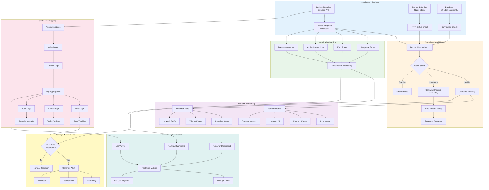

# Monitoring & Health Checks Architecture

This diagram shows the comprehensive monitoring and health check system for KARS.

## Monitoring Architecture



## Health Check Configuration

### Backend Health Check

**Endpoint:** `GET /api/health`

**Implementation (server.js):**
```javascript
app.get('/api/health', (req, res) => {
  // Check database connection
  const dbHealthy = checkDatabaseConnection();
  
  res.status(dbHealthy ? 200 : 503).json({
    status: dbHealthy ? 'ok' : 'unhealthy',
    timestamp: new Date().toISOString(),
    database: dbHealthy ? 'connected' : 'disconnected',
    version: process.env.npm_package_version
  });
});
```

**Docker Health Check:**
```dockerfile
HEALTHCHECK --interval=30s --timeout=5s --start-period=10s --retries=3 \
  CMD node -e "require('http').get('http://localhost:3001/api/health', (r) => process.exit(r.statusCode === 200 ? 0 : 1))"
```

**Parameters:**
- `interval`: Check every 30 seconds
- `timeout`: Fail if no response in 5 seconds
- `start-period`: 10-second grace period on startup
- `retries`: Mark unhealthy after 3 consecutive failures

**Manual Test:**
```bash
# From host
curl http://localhost:3001/api/health

# From container
docker exec asset-registration-backend \
  curl http://localhost:3001/api/health

# Expected response
{
  "status": "ok",
  "timestamp": "2024-12-18T15:30:00.000Z",
  "database": "connected",
  "version": "1.0.0"
}
```

### Frontend Health Check

**Docker Health Check:**
```dockerfile
HEALTHCHECK --interval=30s --timeout=5s --retries=3 \
  CMD wget --quiet --tries=1 --spider http://localhost:80 || exit 1
```

**Manual Test:**
```bash
# HTTP status check
curl -I http://localhost:80

# Expected: HTTP/1.1 200 OK
```

### Database Health Check

**SQLite:**
```bash
# Check file integrity
docker exec asset-registration-backend \
  sqlite3 /app/data/assets.db "PRAGMA integrity_check;"

# Expected output: ok
```

**PostgreSQL:**
```bash
# Connection check
railway run psql $DATABASE_URL -c "SELECT 1;"

# Response time check
time railway run psql $DATABASE_URL -c "SELECT 1;"

# Check active connections
railway run psql $DATABASE_URL -c "\
  SELECT count(*) as active_connections \
  FROM pg_stat_activity \
  WHERE state = 'active';"
```

---

## Monitoring Metrics

### System Metrics

**CPU Usage:**
```bash
# Docker stats
docker stats asset-registration-backend --no-stream

# Expected: < 70% under normal load

# Railway
railway status
# View CPU usage in Railway Dashboard → Metrics
```

**Memory Usage:**
```bash
# Docker stats
docker stats asset-registration-backend --no-stream --format "table {{.Name}}\t{{.MemUsage}}\t{{.MemPerc}}"

# Expected: < 80% of allocated memory

# Check for memory leaks
watch -n 5 "docker stats asset-registration-backend --no-stream"
```

**Disk Usage:**
```bash
# Check volume size
docker system df -v | grep asset-data

# Database size
docker exec asset-registration-backend \
  du -sh /app/data/

# PostgreSQL
railway run psql $DATABASE_URL -c "\
  SELECT pg_size_pretty(pg_database_size(current_database()));"
```

**Network I/O:**
```bash
# Docker network stats
docker stats asset-registration-backend --format "table {{.Name}}\t{{.NetIO}}"

# Railway
# View in Railway Dashboard → Metrics → Network
```

### Application Metrics

**Response Times:**
```bash
# Test API response time
time curl http://localhost:3001/api/health

# Expected: < 500ms

# Test multiple endpoints
for endpoint in health assets companies users; do
  echo -n "$endpoint: "
  time curl -s http://localhost:3001/api/$endpoint > /dev/null
done
```

**Error Rates:**
```bash
# Count errors in logs
docker logs asset-registration-backend --since 1h | grep -ci error

# Expected: < 10 per hour under normal operation

# Error rate percentage
TOTAL=$(docker logs asset-registration-backend --since 1h | wc -l)
ERRORS=$(docker logs asset-registration-backend --since 1h | grep -ci error)
echo "Error rate: $(echo "scale=2; $ERRORS / $TOTAL * 100" | bc)%"
```

**Request Throughput:**
```bash
# Count requests in last hour
docker logs asset-registration-frontend --since 1h | grep -c "GET"

# Requests per minute
RPM=$(docker logs asset-registration-frontend --since 1m | grep -c "GET")
echo "Requests per minute: $RPM"
```

**Active Connections:**
```bash
# PostgreSQL connections
railway run psql $DATABASE_URL -c "\
  SELECT count(*) as active_connections, state \
  FROM pg_stat_activity \
  GROUP BY state;"

# Expected: < 80% of max_connections
```

### Database Metrics

**Query Performance:**
```bash
# Slow query log (PostgreSQL)
railway run psql $DATABASE_URL -c "\
  SELECT query, calls, mean_exec_time, max_exec_time \
  FROM pg_stat_statements \
  ORDER BY mean_exec_time DESC \
  LIMIT 10;"

# Table sizes
railway run psql $DATABASE_URL -c "\
  SELECT schemaname, tablename, \
         pg_size_pretty(pg_total_relation_size(schemaname||'.'||tablename)) AS size \
  FROM pg_tables \
  WHERE schemaname = 'public' \
  ORDER BY pg_total_relation_size(schemaname||'.'||tablename) DESC;"
```

**Index Usage:**
```bash
# Check index usage
railway run psql $DATABASE_URL -c "\
  SELECT schemaname, tablename, indexname, idx_scan \
  FROM pg_stat_user_indexes \
  ORDER BY idx_scan ASC \
  LIMIT 10;"

# Unused indexes (idx_scan = 0)
```

---

## Logging

### Log Levels

| Level | Usage | Example |
|-------|-------|---------|
| **ERROR** | Application errors | Database connection failed |
| **WARN** | Warning conditions | Deprecated API usage |
| **INFO** | Informational | User logged in |
| **DEBUG** | Debug information | Query executed: SELECT ... |

### Backend Logging

**Log Format:**
```javascript
// Structured logging
console.log(JSON.stringify({
  level: 'INFO',
  timestamp: new Date().toISOString(),
  message: 'User logged in',
  userId: user.id,
  email: user.email,
  ip: req.ip
}));
```

**View Logs:**
```bash
# All logs
docker logs asset-registration-backend

# Follow logs
docker logs -f asset-registration-backend

# Last 100 lines
docker logs --tail=100 asset-registration-backend

# Since timestamp
docker logs --since "2024-12-18T15:00:00" asset-registration-backend

# Filter errors
docker logs asset-registration-backend | grep ERROR

# Railway
railway logs --service backend --follow
```

### Frontend Logging

**Nginx Access Log:**
```bash
# View access log
docker logs asset-registration-frontend

# Access log format:
# 192.168.1.1 - - [18/Dec/2024:15:30:00 +0000] "GET /api/assets HTTP/1.1" 200 1234

# Count requests by status code
docker logs asset-registration-frontend | awk '{print $9}' | sort | uniq -c

# Top requested URLs
docker logs asset-registration-frontend | awk '{print $7}' | sort | uniq -c | sort -rn | head -10
```

### Audit Logging

**Database Audit Logs:**
```bash
# View recent audit logs
railway run psql $DATABASE_URL -c "\
  SELECT timestamp, user_email, action, resource_type, resource_id \
  FROM audit_logs \
  ORDER BY timestamp DESC \
  LIMIT 20;"

# Count by action type
railway run psql $DATABASE_URL -c "\
  SELECT action, COUNT(*) as count \
  FROM audit_logs \
  GROUP BY action \
  ORDER BY count DESC;"

# User activity
railway run psql $DATABASE_URL -c "\
  SELECT user_email, COUNT(*) as actions \
  FROM audit_logs \
  WHERE timestamp > NOW() - INTERVAL '24 hours' \
  GROUP BY user_email \
  ORDER BY actions DESC;"
```

---

## Alerting

### Alert Configuration

**Critical Alerts (PagerDuty):**
- Service down (health check fails)
- Error rate > 5%
- Response time > 5 seconds
- Database connection lost
- Disk usage > 90%

**Warning Alerts (Slack/Email):**
- CPU usage > 70%
- Memory usage > 80%
- Disk usage > 75%
- Error rate > 1%
- Response time > 2 seconds

### Railway Alerts

**Setup:**
1. Railway Dashboard → Project → Settings
2. Notifications → Add Webhook
3. Configure Slack/Discord webhook URL
4. Select events:
   - Deployment started
   - Deployment failed
   - Service crashed
   - Health check failed

**Slack Webhook Example:**
```bash
# Send alert to Slack
curl -X POST "https://hooks.slack.com/services/YOUR/WEBHOOK/URL" \
  -H "Content-Type: application/json" \
  -d '{
    "text": "🚨 KARS Backend Health Check Failed",
    "attachments": [{
      "color": "danger",
      "fields": [
        {"title": "Service", "value": "backend", "short": true},
        {"title": "Status", "value": "unhealthy", "short": true},
        {"title": "Time", "value": "2024-12-18 15:30:00 UTC", "short": false}
      ]
    }]
  }'
```

### Custom Alerting Script

**Monitor and Alert:**
```bash
#!/bin/bash
# /usr/local/bin/kars-monitor.sh

HEALTH_URL="http://localhost:3001/api/health"
SLACK_WEBHOOK="https://hooks.slack.com/services/YOUR/WEBHOOK/URL"

# Check health
RESPONSE=$(curl -s -o /dev/null -w "%{http_code}" "$HEALTH_URL")

if [ "$RESPONSE" != "200" ]; then
    # Send alert
    curl -X POST "$SLACK_WEBHOOK" \
      -H "Content-Type: application/json" \
      -d "{\"text\":\"🚨 KARS Health Check Failed: HTTP $RESPONSE\"}"
    
    echo "ALERT: Health check failed with HTTP $RESPONSE"
    exit 1
fi

echo "OK: Health check passed"
```

**Cron Job:**
```bash
# Run every 5 minutes
*/5 * * * * /usr/local/bin/kars-monitor.sh
```

---

## Monitoring Dashboards

### Railway Dashboard

**Access:** https://railway.app/project/[project-id]

**Available Metrics:**
- **Deployments:** Status, logs, history
- **Metrics:**
  - CPU usage (%)
  - Memory usage (MB)
  - Network I/O (MB)
  - Active connections
- **Logs:** Real-time application logs
- **Database:** PostgreSQL metrics, backups

### Portainer Dashboard

**Access:** https://portainer.example.com

**Available Metrics:**
- **Containers:** Status, health, resource usage
- **Images:** Size, age, registry
- **Volumes:** Usage, size
- **Networks:** Traffic, connections
- **Stacks:** Deployment status

### Custom Dashboard (Optional)

**Grafana + Prometheus:**

```yaml
# docker-compose.monitoring.yml
services:
  prometheus:
    image: prom/prometheus
    volumes:
      - ./prometheus.yml:/etc/prometheus/prometheus.yml
      - prometheus-data:/prometheus
    ports:
      - "9090:9090"
  
  grafana:
    image: grafana/grafana
    volumes:
      - grafana-data:/var/lib/grafana
    ports:
      - "3000:3000"
    environment:
      - GF_SECURITY_ADMIN_PASSWORD=admin
```

**Prometheus Config:**
```yaml
# prometheus.yml
global:
  scrape_interval: 30s

scrape_configs:
  - job_name: 'kars-backend'
    static_configs:
      - targets: ['asset-registration-backend:3001']
    metrics_path: '/api/metrics'  # If implemented
```

---

## Best Practices

### 1. Multiple Health Check Levels

- **Liveness:** Is service running?
- **Readiness:** Can service handle requests?
- **Startup:** Has service finished initializing?

### 2. Appropriate Intervals

```yaml
# Don't check too frequently (wastes resources)
interval: 30s  # Good

# Don't check too infrequently (miss issues)
interval: 5m   # Too long
```

### 3. Grace Periods

```yaml
# Allow time for startup
start-period: 10s

# Backend with DB migrations might need more
start-period: 30s
```

### 4. Fail Fast

```yaml
# Mark unhealthy quickly
retries: 3
timeout: 5s

# Better than:
retries: 10  # Takes too long to detect failure
timeout: 30s
```

### 5. Comprehensive Logging

- Log all errors with context
- Use structured logging (JSON)
- Include timestamps and request IDs
- Avoid logging sensitive data

### 6. Alert Fatigue Prevention

- Set appropriate thresholds
- Use escalation policies
- Aggregate similar alerts
- Implement alert suppression during maintenance

---

## Troubleshooting

### High CPU Usage

**Diagnosis:**
```bash
# Identify process
docker exec asset-registration-backend top -bn1

# Check for CPU-intensive queries
railway run psql $DATABASE_URL -c "\
  SELECT pid, query, state, query_start \
  FROM pg_stat_activity \
  WHERE state = 'active' \
  ORDER BY query_start;"
```

**Solutions:**
- Optimize slow queries
- Add database indexes
- Scale horizontally (add replicas)
- Upgrade server resources

### High Memory Usage

**Diagnosis:**
```bash
# Memory breakdown
docker exec asset-registration-backend node -e "console.log(process.memoryUsage())"

# Check for memory leaks
# Monitor over time
watch -n 10 "docker stats asset-registration-backend --no-stream"
```

**Solutions:**
- Implement pagination for large datasets
- Add memory limits
- Fix memory leaks in code
- Restart service periodically

### Logs Not Appearing

**Diagnosis:**
```bash
# Check Docker logging driver
docker inspect asset-registration-backend | grep LogConfig

# Check disk space
df -h
```

**Solutions:**
```bash
# Rotate logs
docker logs asset-registration-backend > /dev/null

# Configure log rotation in Docker
# Edit /etc/docker/daemon.json
{
  "log-driver": "json-file",
  "log-opts": {
    "max-size": "10m",
    "max-file": "3"
  }
}
```

---

## Related Documentation

- [Incident Response](../INCIDENT-RESPONSE.md) - Using monitoring for incidents
- [Release Checklist](../RELEASE-CHECKLIST.md) - Post-deployment monitoring
- [Database Backup & Restore](database-backup-restore.md) - Database health
- [Portainer Deployment](portainer-deployment.md) - Portainer monitoring
- [Railway Deployment](railway-deployment.md) - Railway monitoring

---

**Last Updated:** December 2024  
**Maintained By:** DevOps Team
