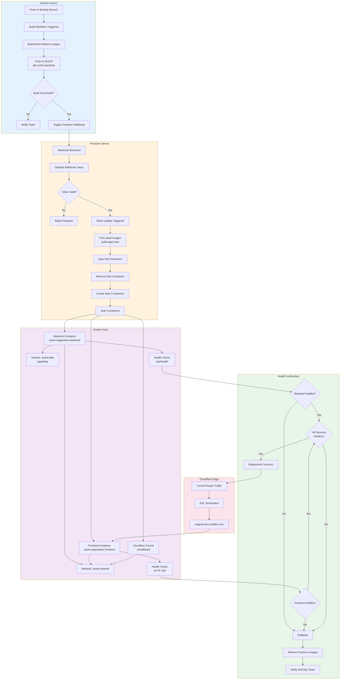

# Portainer Deployment Flow

This diagram shows the deployment process for KARS on Portainer (staging environment).

## Deployment Architecture



## Deployment Components

### 1. Portainer Stack

**Stack Name:** `asset-registration`

**Compose File:** `docker-compose.portainer.yml`

```yaml
version: '3.8'

services:
  backend:
    image: ghcr.io/${GITHUB_REPOSITORY}/backend:develop
    container_name: asset-registration-backend
    pull_policy: always
    environment:
      - NODE_ENV=staging
      - JWT_SECRET=${JWT_SECRET}
      - ADMIN_EMAIL=${ADMIN_EMAIL}
      - DB_CLIENT=sqlite
    volumes:
      - asset-data:/app/data
    networks:
      - asset-network
    restart: unless-stopped
    healthcheck:
      test: ["CMD", "node", "-e", "require('http').get('http://localhost:3001/api/health', (r) => process.exit(r.statusCode === 200 ? 0 : 1))"]
      interval: 30s
      timeout: 5s
      retries: 3
      start_period: 10s

  frontend:
    image: ghcr.io/${GITHUB_REPOSITORY}/frontend:develop
    container_name: asset-registration-frontend
    pull_policy: always
    ports:
      - "${APP_PORT:-8080}:80"
    depends_on:
      backend:
        condition: service_healthy
    networks:
      - asset-network
    restart: unless-stopped
    healthcheck:
      test: ["CMD", "wget", "--quiet", "--tries=1", "--spider", "http://localhost:80"]
      interval: 30s
      timeout: 5s
      retries: 3

networks:
  asset-network:
    driver: bridge

volumes:
  asset-data:
    driver: local
```

### 2. Environment Variables

**Required in Portainer Stack:**

| Variable | Example | Description |
|----------|---------|-------------|
| `GITHUB_REPOSITORY` | `humac/kars` | GitHub repo for image paths |
| `APP_PORT` | `8080` | External port mapping |
| `JWT_SECRET` | `<secure-random-64char>` | JWT signing key |
| `ADMIN_EMAIL` | `admin@jvhlabs.com` | Auto-admin email |

**Optional:**
- `DB_CLIENT` - Database type (sqlite/postgres)
- `POSTGRES_URL` - PostgreSQL connection string
- `PASSKEY_RP_ID` - WebAuthn relying party ID
- `OIDC_*` - OIDC/SSO configuration

### 3. Webhook Configuration

**Webhook URL Format:**
```
https://portainer.example.com/api/stacks/webhooks/<webhook-id>?pullImage=true
```

**Important:** `pullImage=true` parameter ensures latest images are pulled

**Setup Steps:**

1. In Portainer → Stacks → asset-registration
2. Scroll to "Webhooks" section
3. Click "Create a webhook"
4. ✅ Enable "Pull latest image version"
5. Copy webhook URL
6. Add to GitHub Secrets as `PORTAINER_WEBHOOK_URL`

---

## Deployment Process

### Automatic Deployment (Recommended)

**Trigger:** Push to `develop` branch

**Flow:**
1. Developer merges PR to `develop`
2. GitHub Actions builds images
3. Images pushed to GHCR
4. Webhook triggered automatically
5. Portainer pulls and deploys

**Duration:** ~10-15 minutes total

**Monitoring:**
```bash
# Watch GitHub Actions
https://github.com/humac/kars/actions

# Watch Portainer logs
docker logs -f asset-registration-backend
docker logs -f asset-registration-frontend
```

### Manual Deployment

**Option 1: Trigger Webhook**
```bash
curl -X POST "$PORTAINER_WEBHOOK_URL"
```

**Option 2: Portainer UI**
1. Navigate to Stacks → asset-registration
2. Click "Update the stack"
3. ✅ Enable "Pull latest image"
4. Click "Update"

**Option 3: Docker CLI (on host)**
```bash
# Pull latest images
docker pull ghcr.io/humac/kars/backend:develop
docker pull ghcr.io/humac/kars/frontend:develop

# Restart stack
cd /path/to/stack
docker-compose pull
docker-compose up -d
```

---

## Health Checks

### Backend Health Check

**Endpoint:** `http://asset-registration-backend:3001/api/health`

**Configuration:**
```yaml
healthcheck:
  test: ["CMD", "node", "-e", "require('http').get('http://localhost:3001/api/health', (r) => process.exit(r.statusCode === 200 ? 0 : 1))"]
  interval: 30s
  timeout: 5s
  retries: 3
  start_period: 10s
```

**Expected Response:**
```json
{
  "status": "ok",
  "timestamp": "2024-12-18T15:30:00.000Z"
}
```

**Check Manually:**
```bash
# From host
curl http://localhost:3001/api/health

# From container
docker exec asset-registration-backend \
  wget -q -O - http://localhost:3001/api/health
```

### Frontend Health Check

**Endpoint:** `http://asset-registration-frontend:80`

**Configuration:**
```yaml
healthcheck:
  test: ["CMD", "wget", "--quiet", "--tries=1", "--spider", "http://localhost:80"]
  interval: 30s
  timeout: 5s
  retries: 3
```

**Check Manually:**
```bash
# From host
curl -I http://localhost:8080

# From container
docker exec asset-registration-frontend \
  wget -q -O - http://localhost:80
```

### Container Status

```bash
# Check all containers
docker ps | grep asset-registration

# Check health status
docker inspect asset-registration-backend | grep -A 10 Health

# View health check logs
docker inspect asset-registration-backend \
  --format='{{range .State.Health.Log}}{{.Output}}{{end}}'
```

---

## Monitoring

### Container Logs

```bash
# View logs
docker logs asset-registration-backend
docker logs asset-registration-frontend

# Follow logs in real-time
docker logs -f asset-registration-backend

# Last 100 lines
docker logs --tail=100 asset-registration-backend

# Filter errors
docker logs asset-registration-backend 2>&1 | grep -i error
```

### Portainer Monitoring

**Dashboard View:**
1. Navigate to Containers
2. View asset-registration containers
3. Monitor CPU, Memory, Network usage

**Alert Configuration:**
1. Portainer → Notifications
2. Configure webhook for alerts
3. Set thresholds (CPU > 80%, Memory > 90%)

### Resource Usage

```bash
# Real-time stats
docker stats asset-registration-backend asset-registration-frontend

# Check disk usage
docker system df

# Check volume size
docker volume inspect asset-data
```

---

## Rollback Procedures

### Automatic Rollback

Portainer doesn't have built-in automatic rollback, but health checks prevent bad deployments from fully starting.

### Manual Rollback

#### Option 1: Redeploy Previous Version

```bash
# In GitHub Actions, trigger deploy workflow
# Select specific commit SHA or tag

# Or manually in Portainer:
# 1. Edit stack
# 2. Change image tags to previous version
# Example: backend:develop-sha-abc123
# 3. Update stack
```

#### Option 2: Revert Git Commit

```bash
# Revert bad commit on develop
git revert <bad-commit-sha>
git push origin develop

# GitHub Actions will auto-deploy the revert
```

#### Option 3: Restore from Backup

```bash
# Stop containers
docker-compose down

# Restore database volume
docker run --rm \
  -v asset-data:/data \
  -v $(pwd)/backups:/backup \
  alpine tar xzf /backup/asset-data-YYYYMMDD.tar.gz -C /data

# Start containers with previous images
docker-compose up -d
```

---

## Troubleshooting

### Issue: Webhook Not Triggering Deployment

**Diagnosis:**
```bash
# Test webhook manually
curl -v -X POST "$PORTAINER_WEBHOOK_URL"

# Check Portainer logs
docker logs portainer

# Verify webhook exists in Portainer
# Stacks → asset-registration → Webhooks
```

**Common Causes:**
- Webhook URL incorrect or expired
- `pullImage=true` not set
- Portainer down or unreachable
- Network connectivity issue

**Solution:**
```bash
# Recreate webhook in Portainer
# 1. Delete old webhook
# 2. Create new webhook with pullImage=true
# 3. Update GitHub Secret: PORTAINER_WEBHOOK_URL
```

### Issue: Containers Won't Start

**Diagnosis:**
```bash
# Check container status
docker ps -a | grep asset-registration

# View logs
docker logs asset-registration-backend

# Check for port conflicts
netstat -tlnp | grep 8080
```

**Common Causes:**
- Port already in use
- Environment variables missing
- Database volume permission issue
- Image pull failure

**Solutions:**
```bash
# Change port in stack environment variables
APP_PORT=8081

# Fix volume permissions
docker exec -it asset-registration-backend chown -R node:node /app/data

# Pull images manually
docker pull ghcr.io/humac/kars/backend:develop
```

### Issue: Images Not Updating

**Diagnosis:**
```bash
# Check image digest
docker images ghcr.io/humac/kars/backend --digests

# Check when image was pulled
docker inspect ghcr.io/humac/kars/backend:develop | grep Created
```

**Cause:** Images cached, `pullImage=true` not set

**Solution:**
```bash
# Force pull in Portainer
# Stack → Update → ✅ Pull latest image

# Or manually pull
docker pull ghcr.io/humac/kars/backend:develop
docker pull ghcr.io/humac/kars/frontend:develop

# Restart stack
docker-compose up -d
```

### Issue: Health Checks Failing

**Diagnosis:**
```bash
# Check health status
docker inspect asset-registration-backend | grep -A 20 Health

# Test health endpoint directly
docker exec asset-registration-backend \
  curl http://localhost:3001/api/health

# Check backend logs for startup errors
docker logs asset-registration-backend
```

**Common Causes:**
- Application not fully started
- Database connection failure
- Port not exposed correctly

**Solutions:**
```bash
# Increase start_period in health check
# Edit stack, modify healthcheck:
# start_period: 30s  # Give more time to start

# Check environment variables
docker exec asset-registration-backend env | grep JWT_SECRET

# Restart container
docker restart asset-registration-backend
```

---

## Best Practices

### 1. Always Use `pullImage=true`

Ensures latest images are pulled on webhook trigger.

### 2. Monitor Health Checks

Configure alerts for unhealthy containers:
```yaml
healthcheck:
  test: ["CMD", ...]
  interval: 30s
  timeout: 5s
  retries: 3
  start_period: 10s
```

### 3. Use Docker Networks

Isolate stack with dedicated network:
```yaml
networks:
  asset-network:
    driver: bridge
```

### 4. Regular Backups

Schedule automated backups:
```bash
# Add to crontab (daily at 2 AM)
0 2 * * * /usr/local/bin/backup-kars.sh
```

### 5. Version Pinning for Stability

Use SHA-based tags for important deployments:
```yaml
image: ghcr.io/humac/kars/backend:develop-sha-abc123
```

---

## Related Documentation

- [CI/CD Overview](ci-cd-overview.md) - Full pipeline
- [Docker Build Process](docker-build-process.md) - Image builds
- [GitHub Actions Workflow](github-actions-workflow.md) - Workflow details
- [Database Backup & Restore](database-backup-restore.md) - Backup procedures
- [Monitoring & Health Checks](monitoring-health-checks.md) - Monitoring setup

---

**Last Updated:** December 2024  
**Maintained By:** DevOps Team
