# Release Process Workflow

This diagram shows the complete weekly release process for KARS, from code freeze to production deployment.

## Release Workflow

```mermaid
flowchart TB
    subgraph Preparation["Pre-Release (Thursday-Friday AM)"]
        A[Code Freeze<br/>Thursday 5PM EST] --> B[Announce Freeze<br/>Team Notification]
        B --> C[Review develop Branch]
        C --> D{All Features<br/>Ready?}
        D -->|No| E[Wait for Features]
        E --> C
        D -->|Yes| F[Verify CI Status]
        
        F --> G{Tests Passing?}
        G -->|No| H[Fix Test Failures]
        H --> F
        G -->|Yes| I[Staging Verification]
    end
    
    subgraph Testing["Testing Phase (Friday AM)"]
        I --> J[Functional Testing]
        J --> K[Test Authentication]
        J --> L[Test Asset Management]
        J --> M[Test User Management]
        J --> N[Test Admin Features]
        
        K --> O{All Tests Pass?}
        L --> O
        M --> O
        N --> O
        
        O -->|No| P[Fix Issues]
        P --> Q[Redeploy to Staging]
        Q --> J
        
        O -->|Yes| R[Performance Testing]
        R --> S[Security Scan]
        S --> T[Browser Compatibility]
    end
    
    subgraph ReleasePrep["Release Preparation (Friday 1PM EST)"]
        T --> U[Create Release Branch<br/>release/v1.x.x]
        U --> V[Update Version Numbers]
        V --> W[Generate Release Notes]
        W --> X[Create Pull Request<br/>release → main]
        X --> Y[Request Review]
        Y --> Z[PR Approval]
    end
    
    subgraph Deployment["Deployment Phase (Friday 2PM EST)"]
        Z --> AA[Pre-Deployment Checks]
        AA --> AB[Verify Prod Health]
        AB --> AC[Backup Database]
        AC --> AD{Backup Success?}
        AD -->|No| AE[Fix Backup Issue]
        AE --> AC
        AD -->|Yes| AF[Merge PR to main]
        
        AF --> AG[Create Release Tag<br/>v1.x.x]
        AG --> AH[Merge Back to develop]
        AH --> AI[Delete Release Branch]
        
        AI --> AJ[Railway Auto-Deploy]
        AJ --> AK[Build Application]
        AK --> AL[Run Migrations]
        AL --> AM[Deploy Services]
        AM --> AN[Health Checks]
    end
    
    subgraph Verification["Post-Deployment (Friday 2:15-2:30PM EST)"]
        AN --> AO{Services<br/>Healthy?}
        AO -->|No| AP[ROLLBACK]
        AO -->|Yes| AQ[Smoke Tests]
        
        AQ --> AR[Test Login]
        AQ --> AS[Test Asset CRUD]
        AQ --> AT[Test Admin Functions]
        
        AR --> AU{All Tests Pass?}
        AS --> AU
        AT --> AU
        
        AU -->|No| AP
        AU -->|Yes| AV[Performance Check]
        AV --> AW[Error Monitoring]
        AW --> AX[Database Integrity]
    end
    
    subgraph Monitoring["Monitoring Period (Friday 2:30-4PM EST)"]
        AX --> AY[Active Monitoring<br/>First 30 Minutes]
        AY --> AZ[Watch Logs]
        AY --> BA[Monitor Metrics]
        AY --> BB[User Feedback]
        
        AZ --> BC{Issues<br/>Detected?}
        BA --> BC
        BB --> BC
        
        BC -->|Yes| AP
        BC -->|No| BD[Deployment Success]
    end
    
    subgraph Completion["Release Completion (Friday 4PM EST)"]
        BD --> BE[Update Documentation]
        BE --> BF[Create GitHub Release]
        BF --> BG[Notify Stakeholders]
        BG --> BH[Lift Code Freeze]
        BH --> BI[Archive Release Branch]
        BI --> BJ[Schedule Post-Mortem]
    end
    
    subgraph Rollback["Rollback Procedure (If Needed)"]
        AP --> BK[Announce Rollback]
        BK --> BL[Stop Application]
        BL --> BM{Database<br/>Migration?}
        BM -->|Yes| BN[Restore Database]
        BN --> BO[Deploy Previous Version]
        BM -->|No| BO
        BO --> BP[Verify Rollback]
        BP --> BQ[Notify Stakeholders]
        BQ --> BR[Investigation]
        BR --> BS[Schedule Fix]
    end
    
    style Preparation fill:#e3f2fd
    style Testing fill:#fff3e0
    style ReleasePrep fill:#f3e5f5
    style Deployment fill:#e8f5e9
    style Verification fill:#fce4ec
    style Monitoring fill:#fff9c4
    style Completion fill:#e0f2f1
    style Rollback fill:#ffebee
```



## Release Schedule

### Weekly Release Timeline

| Day | Time | Activity | Duration |
|-----|------|----------|----------|
| **Thursday** | 5:00 PM EST | Code Freeze | - |
| **Friday** | 9:00 AM - 12:00 PM | Testing Phase | 3 hours |
| **Friday** | 1:00 PM - 2:00 PM | Release Preparation | 1 hour |
| **Friday** | 2:00 PM - 2:15 PM | Deployment | 15 minutes |
| **Friday** | 2:15 PM - 2:30 PM | Verification | 15 minutes |
| **Friday** | 2:30 PM - 4:00 PM | Monitoring | 1.5 hours |
| **Friday** | 4:00 PM | Release Complete | - |

### Why Friday 2PM EST?

**Benefits:**
- ✅ Off-peak hours (lower traffic)
- ✅ Team available for monitoring
- ✅ Time to rollback before weekend
- ✅ Early enough for issue detection

**Alternatives Considered:**
- ❌ Monday AM: Peak traffic, higher risk
- ❌ Friday evening: Team unavailable
- ❌ Weekend: No team coverage

---

## Phase Details

### 1. Code Freeze (Thursday 5PM EST)

**Purpose:** Stabilize code before release

**Actions:**
```bash
# Announcement template
"📢 Code freeze for v1.x.x release is now active.
No merges to 'develop' until release completes Friday afternoon.
Emergency hotfixes only with approval."
```

**Checklist:**
- [ ] Announce freeze in team chat
- [ ] Update #releases channel
- [ ] Verify all planned features merged
- [ ] Check CI status on develop
- [ ] Document any known issues

---

### 2. Testing Phase (Friday 9AM-12PM)

**Purpose:** Comprehensive validation before production

**Functional Testing:**
```bash
# Test script template
# frontend/test-release.sh

echo "Testing Authentication..."
curl -X POST $STAGING_URL/api/auth/login -d '{"email":"test@example.com","password":"test"}'

echo "Testing Asset Creation..."
curl -X POST $STAGING_URL/api/assets -H "Authorization: Bearer $TOKEN" -d '{...}'

echo "Testing Asset Retrieval..."
curl $STAGING_URL/api/assets -H "Authorization: Bearer $TOKEN"
```

**Performance Testing:**
```bash
# Response time benchmarks
time curl $STAGING_URL/api/health  # < 100ms
time curl $STAGING_URL/api/assets  # < 500ms
time curl $STAGING_URL/api/users   # < 500ms

# Load testing (optional)
ab -n 1000 -c 10 $STAGING_URL/
```

**Security Scan:**
```bash
# npm audit
cd backend && npm audit --audit-level=high
cd frontend && npm audit --audit-level=high

# No high/critical vulnerabilities allowed
```

---

### 3. Release Preparation (Friday 1PM-2PM)

**Create Release Branch:**
```bash
git checkout develop
git pull origin develop
git checkout -b release/v1.x.x
git push origin release/v1.x.x
```

**Update Versions:**
```bash
# Backend
cd backend
npm version patch  # or minor/major
git add package.json package-lock.json
git commit -m "chore: bump backend to v1.x.x"

# Frontend
cd frontend
npm version patch
git add package.json package-lock.json
git commit -m "chore: bump frontend to v1.x.x"

git push origin release/v1.x.x
```

**Generate Release Notes:**
```bash
# Get commits since last release
git log v1.0.0..HEAD --oneline --no-merges

# Create CHANGELOG.md entry
## [1.x.x] - 2024-12-20

### Added
- New feature A
- New feature B

### Changed
- Updated component X
- Improved performance of Y

### Fixed
- Bug in asset registration
- Issue with user permissions

### Security
- Updated vulnerable dependencies
```

**Create Pull Request:**
- Title: "Release v1.x.x"
- Base: main
- Head: release/v1.x.x
- Description: Include release notes
- Reviewers: Team lead

---

### 4. Deployment Phase (Friday 2PM-2:15PM)

**Pre-Deployment Checklist:**
```bash
# Verify production health
curl https://kars.jvhlabs.com/api/health

# Backup database
railway run pg_dump > backup-pre-v1.x.x-$(date +%Y%m%d-%H%M%S).sql

# Verify backup
ls -lh backup-pre-v1.x.x-*.sql
```

**Merge and Tag:**
```bash
# After PR approval
git checkout main
git pull origin main
git merge --no-ff release/v1.x.x
git tag -a v1.x.x -m "Release v1.x.x - Brief description"
git push origin main --tags

# Merge back to develop
git checkout develop
git pull origin develop
git merge --no-ff main
git push origin develop

# Delete release branch
git branch -d release/v1.x.x
git push origin --delete release/v1.x.x
```

**Deploy:**
```bash
# Railway auto-deploys from main
# OR manually trigger:
railway up

# Monitor deployment
railway logs --follow
```

---

### 5. Verification (Friday 2:15PM-2:30PM)

**Smoke Tests:**
```bash
# Health check
curl https://kars.jvhlabs.com/api/health

# Login test
curl -X POST https://kars.jvhlabs.com/api/auth/login \
  -H "Content-Type: application/json" \
  -d '{"email":"admin@example.com","password":"test123"}'

# Asset retrieval (requires auth token)
curl https://kars.jvhlabs.com/api/assets \
  -H "Authorization: Bearer $TOKEN"
```

**Performance Verification:**
```bash
# Response times
time curl https://kars.jvhlabs.com/api/health  # < 500ms
time curl https://kars.jvhlabs.com/api/assets  # < 1s
time curl https://kars.jvhlabs.com/  # < 3s
```

**Error Check:**
```bash
# Check logs for errors
railway logs --since 5m | grep -i error

# Expected: No critical errors
```

**Database Verification:**
```bash
# Check record counts
railway run psql $DATABASE_URL -c "\
  SELECT 'users' as table, COUNT(*) FROM users \
  UNION ALL \
  SELECT 'assets', COUNT(*) FROM assets \
  UNION ALL \
  SELECT 'companies', COUNT(*) FROM companies;"
```

---

### 6. Monitoring Period (Friday 2:30PM-4PM)

**Active Monitoring:**
```bash
# Follow logs
railway logs --follow | tee release-v1.x.x-logs.txt

# Watch health endpoint
watch -n 30 'curl -s https://kars.jvhlabs.com/api/health && echo " - $(date)"'

# Monitor metrics (Railway Dashboard)
# - CPU usage
# - Memory usage
# - Error rate
# - Request latency
```

**Metrics to Watch:**
- Error rate: < 1%
- Response time: < 500ms (API), < 3s (frontend)
- CPU usage: < 70%
- Memory usage: < 80%
- No user-reported issues

**Rollback Triggers:**
- Error rate spike (>5x normal)
- Critical functionality broken
- Data corruption detected
- Security vulnerability introduced
- Performance degradation (>50% slower)

---

### 7. Completion (Friday 4PM)

**Update Documentation:**
```bash
# Update README if needed
# Update CHANGELOG
# Update API docs if endpoints changed
git add README.md CHANGELOG.md docs/
git commit -m "docs: update for v1.x.x release"
git push origin main
```

**Create GitHub Release:**
1. Go to: https://github.com/humac/kars/releases
2. Click "Draft a new release"
3. Select tag: v1.x.x
4. Release title: "v1.x.x - Brief Description"
5. Copy release notes from CHANGELOG
6. Click "Publish release"

**Notify Stakeholders:**
```
✅ RELEASE COMPLETE - v1.x.x

Status: Successful
Deployed: Friday, December 20, 2024 at 2:00 PM EST
Duration: 15 minutes
Downtime: None (zero-downtime deployment)

New Features:
- Feature A: Description
- Feature B: Description

Bug Fixes:
- Fixed issue with asset registration
- Resolved permission bug in user management

Performance Improvements:
- 20% faster API responses
- Reduced database query times

All systems operational and monitoring shows healthy metrics.

Thank you for your patience during the release!
```

**Lift Code Freeze:**
```bash
# Post in team chat
"✅ Release v1.x.x complete and stable!
Code freeze is now lifted. Normal development can resume.
Great work everyone! 🎉"
```

---

## Rollback Procedure

### When to Rollback

Immediate rollback required if:
- [ ] Critical functionality broken
- [ ] Data corruption detected
- [ ] Security vulnerability introduced
- [ ] Error rate > 5x normal
- [ ] Performance > 50% slower
- [ ] Database migration failed

### Rollback Steps

**1. Announce Rollback:**
```
🚨 ROLLBACK IN PROGRESS - v1.x.x

Reason: [Brief description]
Action: Rolling back to v1.y.z
ETA: 10 minutes

All users may experience brief disruption.
```

**2. Execute Rollback:**

**Option A: Railway Dashboard**
```bash
# In Railway Dashboard:
# 1. Go to Deployments
# 2. Find previous successful deployment
# 3. Click "..." → "Redeploy"
# 4. Confirm
```

**Option B: Git Revert**
```bash
# Revert merge commit
git revert -m 1 HEAD
git push origin main

# Railway will auto-deploy the revert
```

**Option C: Deploy Previous Tag**
```bash
# Checkout previous tag
git checkout v1.y.z

# Deploy
railway up --tag v1.y.z
```

**3. Rollback Database (if needed):**
```bash
# Stop application
railway scale web=0

# Restore backup
railway run psql $DATABASE_URL < backup-pre-v1.x.x-YYYYMMDD.sql

# Restart application
railway scale web=1
```

**4. Verify Rollback:**
```bash
# Check health
curl https://kars.jvhlabs.com/api/health

# Test critical paths
# Login, asset CRUD, etc.

# Monitor logs
railway logs --follow
```

**5. Notify Stakeholders:**
```
✅ ROLLBACK COMPLETE

Status: Service restored to v1.y.z
Impact: 15 minutes of disruption
Current State: All systems operational

Next Steps:
- Investigation underway
- Fix scheduled for next release
- Post-mortem meeting tomorrow at 10 AM

Thank you for your understanding.
```

**6. Post-Rollback:**
- [ ] Create incident report
- [ ] Schedule post-mortem
- [ ] Identify root cause
- [ ] Plan fix for next release
- [ ] Update release checklist if needed

---

## Emergency Hotfix Procedure

### When to Hotfix

Hotfix required for:
- Critical production bug
- Security vulnerability
- Data loss issue
- Service outage cause

**Process:**
```bash
# 1. Create hotfix branch from main
git checkout main
git pull origin main
git checkout -b hotfix/v1.x.y

# 2. Apply minimal fix
# ... make changes ...
git commit -m "fix: critical bug description"

# 3. Fast-track testing
# Deploy to staging, test fix only

# 4. Merge to main
git checkout main
git merge --no-ff hotfix/v1.x.y
git tag -a v1.x.y -m "Hotfix: description"
git push origin main --tags

# 5. Merge to develop
git checkout develop
git merge --no-ff hotfix/v1.x.y
git push origin develop

# 6. Deploy
railway up

# 7. Verify fix
# Test the specific issue
# Monitor for 15 minutes

# 8. Notify stakeholders
```

---

## Release Metrics

### Track After Each Release

```markdown
## Release v1.x.x Metrics

**Release Date:** 2024-12-20
**Release Manager:** [Name]

**Timing:**
- Code Freeze: Thursday 17:00 EST
- Testing Complete: Friday 12:00 EST
- Deployment Start: Friday 14:00 EST
- Deployment Complete: Friday 14:15 EST
- Verification Complete: Friday 14:30 EST
- Total Duration: 15 minutes
- Downtime: 0 minutes

**Scope:**
- Commits: 42
- Files Changed: 23
- Lines Added: 1,234
- Lines Removed: 567
- Features: 3
- Bug Fixes: 5

**Quality:**
- Tests Passed: 234/234 (100%)
- Code Coverage: 85%
- Security Vulnerabilities: 0 high/critical
- Performance: +5% faster

**Deployment:**
- Build Time: 4 minutes
- Deploy Time: 3 minutes
- Rollbacks: 0
- Post-Deploy Issues: 0

**Success Criteria:**
✅ Zero downtime
✅ All tests passed
✅ No rollback required
✅ No critical post-deploy issues
✅ User satisfaction maintained
```

---

## Best Practices

### 1. Always Test in Staging First
Never skip staging verification, even for "minor" changes.

### 2. Backup Before Deploy
Always backup database before production deployment.

### 3. Deploy During Low Traffic
Friday afternoon EST is typically low traffic for most applications.

### 4. Monitor Actively
First 30 minutes post-deploy are critical. Watch closely.

### 5. Have Rollback Plan Ready
Always know how to rollback quickly.

### 6. Communicate Clearly
Keep stakeholders informed at all stages.

### 7. Document Everything
Record timeline, issues, resolutions for future reference.

### 8. Learn and Improve
Conduct post-release reviews to improve process.

---

## Related Documentation

- [Release Checklist](../RELEASE-CHECKLIST.md) - Detailed checklist
- [Runbook](../RUNBOOK.md) - Deployment procedures
- [Incident Response](../INCIDENT-RESPONSE.md) - Rollback scenarios
- [CI/CD Overview](ci-cd-overview.md) - Automated pipeline
- [Railway Deployment](railway-deployment.md) - Platform details

---

**Last Updated:** December 2024  
**Maintained By:** DevOps Team  
**Release Schedule:** Weekly (Fridays, 2:00 PM EST)
