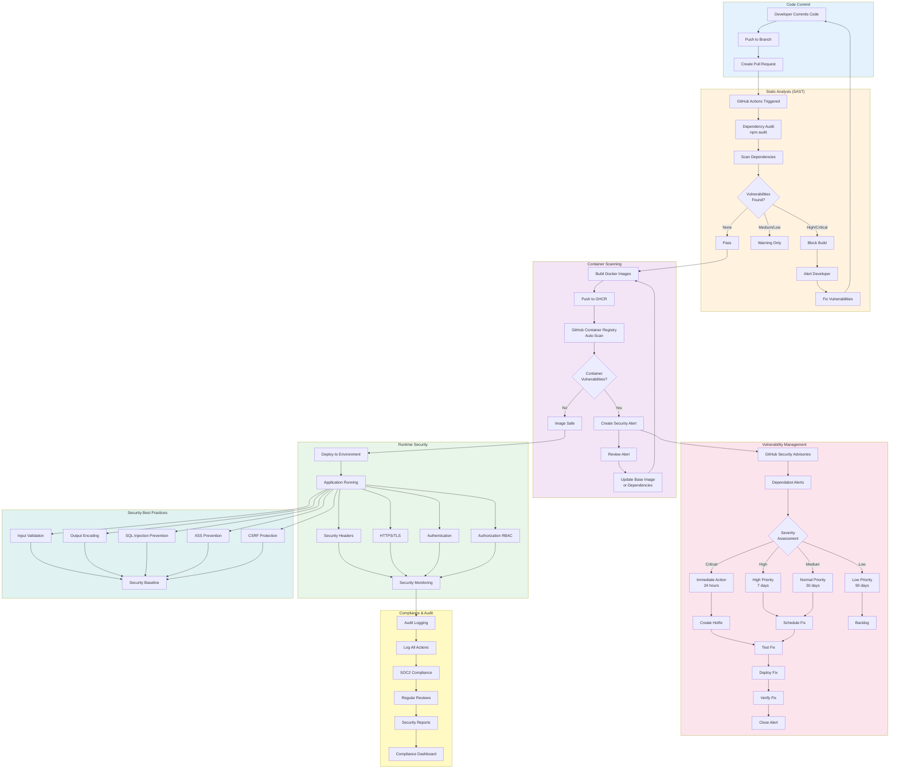

# Security Scanning Pipeline

This diagram shows the comprehensive security scanning and vulnerability management process for KARS.

## Security Pipeline Architecture



## Security Scanning Tools

### 1. npm audit (Dependency Scanning)

**Purpose:** Detect known vulnerabilities in npm dependencies

**When:** Every CI build, before deployment

**Configuration:**
```yaml
# .github/workflows/ci-tests.yml
- name: Security audit
  working-directory: ./${{ matrix.project }}
  run: npm audit --audit-level=high
  continue-on-error: true
```

**Manual Execution:**
```bash
# Audit backend
cd backend
npm audit

# Audit frontend
cd frontend
npm audit

# Fix automatically fixable issues
npm audit fix

# Fix including breaking changes (use with caution)
npm audit fix --force
```

**Audit Levels:**
- `info` - Informational only
- `low` - Low severity
- `moderate` - Medium severity
- `high` - High severity (BLOCKS build)
- `critical` - Critical severity (BLOCKS build)

**Example Output:**
```
found 3 vulnerabilities (1 moderate, 2 high)
  run `npm audit fix` to fix them, or `npm audit` for details
```

**Handling Vulnerabilities:**

**Option 1: Update Dependency**
```bash
# Update specific package
npm update package-name

# Update all packages
npm update

# Check for outdated packages
npm outdated
```

**Option 2: Use Audit Fix**
```bash
# Auto-fix without breaking changes
npm audit fix

# Verify fix
npm audit
```

**Option 3: Override (temporary)**
```json
// package.json
{
  "overrides": {
    "vulnerable-package": "^2.0.0"
  }
}
```

---

### 2. GitHub Container Registry Scanning

**Purpose:** Scan Docker images for vulnerabilities in base images and system packages

**When:** Automatic after push to GHCR

**Coverage:**
- Base OS packages (Alpine Linux)
- Installed system dependencies
- Known CVEs (Common Vulnerabilities and Exposures)

**View Scan Results:**
1. Go to GitHub Repository
2. Navigate to "Security" tab
3. Click "Vulnerability alerts"
4. Filter by "Container scanning"

**Example Alert:**
```
⚠️ High Severity Vulnerability

Package: libssl1.1
Installed Version: 1.1.1k
Fixed Version: 1.1.1l
CVE: CVE-2021-3711

Description: OpenSSL vulnerability allowing remote code execution

Recommendation: Update Alpine base image to latest version
```

**Remediation:**
```dockerfile
# Update Dockerfile base image
FROM node:22-alpine  # Will use latest Alpine

# Or pin to specific version
FROM node:22-alpine3.18
```

---

### 3. GitHub Dependabot

**Purpose:** Automated dependency updates and security alerts

**Configuration:**
```.github/dependabot.yml
version: 2
updates:
  - package-ecosystem: "npm"
    directory: "/backend"
    schedule:
      interval: "weekly"
    open-pull-requests-limit: 5
    
  - package-ecosystem: "npm"
    directory: "/frontend"
    schedule:
      interval: "weekly"
    open-pull-requests-limit: 5
    
  - package-ecosystem: "docker"
    directory: "/"
    schedule:
      interval: "weekly"
```

**Benefits:**
- ✅ Automated PRs for dependency updates
- ✅ Security vulnerability alerts
- ✅ Compatibility checks
- ✅ Automatic version conflict resolution

**Dependabot PR Example:**
```
🤖 Bump express from 4.18.2 to 4.18.3

Bumps express from 4.18.2 to 4.18.3.

Security Fix:
- CVE-2024-XXXX: Fixes prototype pollution vulnerability

Release notes:
- Bug fixes
- Security improvements

Compatibility: 100% (all tests pass)
```

---

## Vulnerability Severity Levels

### Critical (CVSS 9.0-10.0)

**Response Time:** 24 hours  
**Action:** Immediate hotfix deployment

**Example:**
- Remote code execution
- Authentication bypass
- Data exposure

**Response:**
```bash
# 1. Create hotfix branch
git checkout -b hotfix/security-critical

# 2. Update vulnerable dependency
npm update vulnerable-package

# 3. Test fix
npm test

# 4. Deploy immediately
git push origin hotfix/security-critical
# Merge and deploy via hotfix procedure
```

---

### High (CVSS 7.0-8.9)

**Response Time:** 7 days  
**Action:** Scheduled fix in next release

**Example:**
- SQL injection
- Cross-site scripting (XSS)
- Privilege escalation

**Response:**
```bash
# 1. Create issue
# 2. Schedule for next release
# 3. Update dependency or apply patch
# 4. Test thoroughly
# 5. Deploy with regular release
```

---

### Medium (CVSS 4.0-6.9)

**Response Time:** 30 days  
**Action:** Normal priority fix

**Example:**
- Information disclosure
- Denial of service
- Session fixation

---

### Low (CVSS 0.1-3.9)

**Response Time:** 90 days  
**Action:** Backlog, fix when convenient

**Example:**
- Minor information leaks
- Low-impact configuration issues

---

## Security Best Practices Implementation

### 1. Input Validation

**Backend:**
```javascript
// Validate and sanitize inputs
app.post('/api/assets', authenticate, (req, res) => {
  const { make, model, serial_number } = req.body;
  
  // Validate required fields
  if (!make || !model || !serial_number) {
    return res.status(400).json({ error: 'Missing required fields' });
  }
  
  // Sanitize inputs (remove malicious content)
  const sanitizedMake = make.trim().slice(0, 100);
  const sanitizedModel = model.trim().slice(0, 100);
  const sanitizedSerial = serial_number.trim().slice(0, 50);
  
  // Continue processing...
});
```

**Frontend:**
```javascript
// Validate before sending
const validateAssetForm = (data) => {
  if (!data.make || data.make.length < 2) {
    return 'Make must be at least 2 characters';
  }
  if (!data.model || data.model.length < 2) {
    return 'Model must be at least 2 characters';
  }
  // ...
  return null;  // Valid
};
```

---

### 2. SQL Injection Prevention

**Use Parameterized Queries:**
```javascript
// ❌ UNSAFE - SQL Injection vulnerable
db.query(`SELECT * FROM users WHERE email = '${email}'`);

// ✅ SAFE - Parameterized query
db.query('SELECT * FROM users WHERE email = ?', [email]);

// ✅ SAFE - PostgreSQL
db.query('SELECT * FROM users WHERE email = $1', [email]);
```

**ORM/Query Builder:**
```javascript
// Using query builder (better-sqlite3)
const stmt = db.prepare('SELECT * FROM users WHERE email = ?');
const user = stmt.get(email);
```

---

### 3. XSS Prevention

**Output Encoding:**
```javascript
// Frontend - React automatically escapes
<div>{user.name}</div>  // Safe by default

// Dangerous (avoid)
<div dangerouslySetInnerHTML={{__html: user.bio}} />

// Use DOMPurify if HTML needed
import DOMPurify from 'dompurify';
<div dangerouslySetInnerHTML={{__html: DOMPurify.sanitize(user.bio)}} />
```

**Content Security Policy:**
```javascript
// Backend - Set CSP headers
app.use((req, res, next) => {
  res.setHeader(
    'Content-Security-Policy',
    "default-src 'self'; script-src 'self' 'unsafe-inline'; style-src 'self' 'unsafe-inline';"
  );
  next();
});
```

---

### 4. Authentication Security

**JWT Best Practices:**
```javascript
// Strong secret (64+ characters)
const JWT_SECRET = process.env.JWT_SECRET;
if (!JWT_SECRET || JWT_SECRET.length < 64) {
  throw new Error('JWT_SECRET must be at least 64 characters');
}

// Short expiration
const token = jwt.sign(payload, JWT_SECRET, { expiresIn: '7d' });

// Verify on every request
const authenticate = (req, res, next) => {
  try {
    const token = req.headers.authorization?.split(' ')[1];
    const decoded = jwt.verify(token, JWT_SECRET);
    req.user = decoded;
    next();
  } catch (error) {
    res.status(401).json({ error: 'Invalid token' });
  }
};
```

**Password Security:**
```javascript
// Use bcrypt with appropriate rounds
const bcrypt = require('bcrypt');
const SALT_ROUNDS = 10;

// Hash password
const hashedPassword = await bcrypt.hash(password, SALT_ROUNDS);

// Verify password
const valid = await bcrypt.compare(password, hashedPassword);
```

---

### 5. HTTPS/TLS

**Production:**
```javascript
// Enforce HTTPS in production
if (process.env.NODE_ENV === 'production') {
  app.use((req, res, next) => {
    if (req.header('x-forwarded-proto') !== 'https') {
      return res.redirect(`https://${req.header('host')}${req.url}`);
    }
    next();
  });
}
```

**Security Headers:**
```javascript
// Use Helmet.js for security headers
const helmet = require('helmet');
app.use(helmet());

// Equivalent to:
app.use(helmet.contentSecurityPolicy());
app.use(helmet.dnsPrefetchControl());
app.use(helmet.frameguard());
app.use(helmet.hidePoweredBy());
app.use(helmet.hsts());
app.use(helmet.ieNoOpen());
app.use(helmet.noSniff());
app.use(helmet.permittedCrossDomainPolicies());
app.use(helmet.referrerPolicy());
app.use(helmet.xssFilter());
```

---

### 6. Rate Limiting

**Prevent Brute Force:**
```javascript
const rateLimit = require('express-rate-limit');

// General rate limiting
const limiter = rateLimit({
  windowMs: 15 * 60 * 1000,  // 15 minutes
  max: 100,  // Limit each IP to 100 requests per windowMs
  message: 'Too many requests, please try again later.'
});

app.use('/api/', limiter);

// Strict rate limiting for auth endpoints
const authLimiter = rateLimit({
  windowMs: 15 * 60 * 1000,
  max: 5,  // Only 5 login attempts per 15 minutes
  message: 'Too many login attempts, please try again later.'
});

app.use('/api/auth/login', authLimiter);
```

---

## Security Monitoring

### Audit Logging

**Log All Security-Relevant Events:**
```javascript
// Create audit log entry
const auditDb = {
  create: async ({ action, user_email, resource_type, resource_id, details }) => {
    db.prepare(`
      INSERT INTO audit_logs (timestamp, action, user_email, resource_type, resource_id, details)
      VALUES (datetime('now'), ?, ?, ?, ?, ?)
    `).run(action, user_email, resource_type, resource_id, JSON.stringify(details));
  }
};

// Log login attempts
app.post('/api/auth/login', async (req, res) => {
  const { email, password } = req.body;
  
  const user = await userDb.getByEmail(email);
  const valid = user && await bcrypt.compare(password, user.password);
  
  // Log attempt
  await auditDb.create({
    action: valid ? 'LOGIN_SUCCESS' : 'LOGIN_FAILED',
    user_email: email,
    resource_type: 'auth',
    resource_id: user?.id || 'N/A',
    details: { ip: req.ip, user_agent: req.headers['user-agent'] }
  });
  
  // ...
});
```

**Monitor Suspicious Activity:**
```sql
-- Failed login attempts
SELECT user_email, COUNT(*) as failed_attempts
FROM audit_logs
WHERE action = 'LOGIN_FAILED'
  AND timestamp > datetime('now', '-1 hour')
GROUP BY user_email
HAVING failed_attempts > 5;

-- Unusual data access
SELECT user_email, COUNT(*) as access_count
FROM audit_logs
WHERE action = 'READ'
  AND timestamp > datetime('now', '-1 hour')
GROUP BY user_email
HAVING access_count > 100;
```

---

## SOC2 Compliance

### Access Control

**Role-Based Access Control (RBAC):**
```javascript
// Middleware for authorization
const authorize = (...roles) => {
  return (req, res, next) => {
    if (!req.user) {
      return res.status(401).json({ error: 'Not authenticated' });
    }
    
    if (!roles.includes(req.user.role)) {
      await auditDb.create({
        action: 'UNAUTHORIZED_ACCESS_ATTEMPT',
        user_email: req.user.email,
        resource_type: 'endpoint',
        resource_id: req.path,
        details: { required_roles: roles, user_role: req.user.role }
      });
      
      return res.status(403).json({ error: 'Insufficient permissions' });
    }
    
    next();
  };
};

// Use in routes
app.post('/api/users', authenticate, authorize('admin'), async (req, res) => {
  // Only admins can create users
});
```

### Data Encryption

**At Rest:**
```javascript
// Encrypt sensitive data before storage
const crypto = require('crypto');

const encrypt = (text, key) => {
  const iv = crypto.randomBytes(16);
  const cipher = crypto.createCipheriv('aes-256-gcm', key, iv);
  let encrypted = cipher.update(text, 'utf8', 'hex');
  encrypted += cipher.final('hex');
  const authTag = cipher.getAuthTag();
  return `${iv.toString('hex')}:${authTag.toString('hex')}:${encrypted}`;
};

// Example: Encrypt SMTP password
const encryptedPassword = encrypt(smtpPassword, MASTER_KEY);
```

**In Transit:**
- All API communication over HTTPS/TLS
- Database connections encrypted (PostgreSQL SSL)
- No sensitive data in URLs or logs

---

## Security Checklist

### Before Every Release

- [ ] Run npm audit (no high/critical)
- [ ] Review Dependabot alerts
- [ ] Check container scan results
- [ ] Verify HTTPS/TLS certificates
- [ ] Review audit logs for anomalies
- [ ] Test authentication flows
- [ ] Verify RBAC permissions
- [ ] Check for exposed secrets
- [ ] Review security headers
- [ ] Test rate limiting

### Monthly Security Review

- [ ] Review all security alerts
- [ ] Update dependencies
- [ ] Review audit logs
- [ ] Check access control lists
- [ ] Verify backup encryption
- [ ] Review user permissions
- [ ] Test disaster recovery
- [ ] Update security documentation

---

## Incident Response

### Security Incident Procedure

**If Security Breach Suspected:**

1. **Immediate Actions** (0-15 minutes)
   - Alert security team
   - Preserve evidence (logs, database snapshots)
   - Contain breach (revoke credentials, isolate systems)

2. **Assessment** (15-60 minutes)
   - Determine scope of breach
   - Identify compromised data
   - Assess business impact

3. **Remediation** (1-4 hours)
   - Patch vulnerability
   - Rotate all credentials
   - Deploy fix

4. **Recovery** (4-24 hours)
   - Restore affected systems
   - Verify security
   - Monitor for recurrence

5. **Post-Incident** (24-48 hours)
   - Notify affected parties
   - Document incident
   - Implement preventive measures
   - Compliance reporting (if required)

---

## Related Documentation

- [Incident Response](../INCIDENT-RESPONSE.md) - Security incidents
- [CI/CD Overview](ci-cd-overview.md) - Automated scanning
- [GitHub Actions Workflow](github-actions-workflow.md) - CI security checks
- [Monitoring & Health Checks](monitoring-health-checks.md) - Security monitoring

---

**Last Updated:** December 2024  
**Maintained By:** Security Team & DevOps  
**Security Contact:** security@company.com
