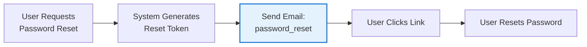
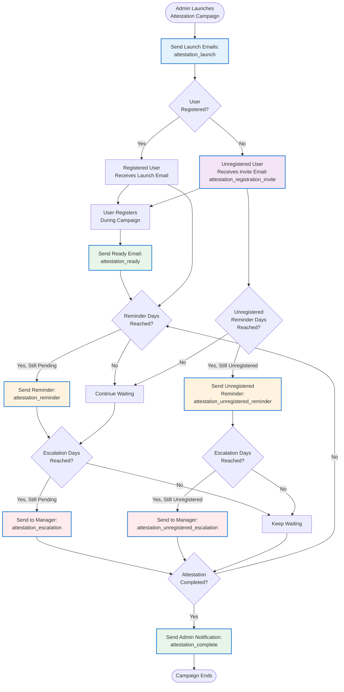
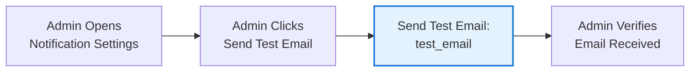

# Admin Guide

Complete guide for system administrators.

## 📋 Table of Contents

1. [Admin Overview](#admin-overview)
2. [First Admin Setup](#first-admin-setup)
3. [User Management](#user-management)
4. [Company Management](#company-management)
5. [System Monitoring](#system-monitoring)
6. [Audit & Compliance](#audit--compliance)
7. [Security Best Practices](#security-best-practices)
8. [Backup & Maintenance](#backup--maintenance)

## Admin Overview

As an administrator, you have full access to all system features and settings. The admin role includes exclusive access to:

- **User Management** - Add, edit, and remove users; change roles
- **Company Management** - Full CRUD operations on companies
- **Complete Audit Logs** - View all system activity
- **All Assets** - View and manage all registered assets
- **System Settings** - Configure application settings

### Admin Navigation

Admins see additional tabs in the navigation:
- **Company Management** (admin-only tab)
- **Admin Settings** (purple tab, admin-only)

## First Admin Setup

### Method 1: First User Automatic Promotion (Recommended)

The **very first user** to register automatically becomes an admin.

**Steps:**
1. Deploy the application
2. Navigate to the registration page
3. Register your account
4. You'll be automatically assigned the admin role
5. Login and access all admin features

**Console Output:**
```
Creating admin user: your-email@domain.com (first user)
```

### Method 2: Environment Variable

Set a specific email to always become admin upon registration.

**Steps:**
1. Edit your `.env` file (or set in Portainer)
2. Add: `ADMIN_EMAIL=your-admin@domain.com`
3. Restart the backend service
4. Register with that email
5. You'll be assigned admin role

**Console Output:**
```
Creating admin user: your-admin@domain.com (admin email match)
```

### Method 3: Promote Existing User

If you're already an admin, promote another user:

1. Go to the **Users** page from the main navigation
2. Find the user in the table
3. Change their role dropdown to "Admin"
4. Role is updated immediately

## User Management

Access: **Users** page (main navigation - accessible to Managers and Admins)

**Managers** have read-only access to view user information, while **Admins** have full access to manage users.

### Viewing Users

The user table shows:
- **Name** - User's full name
- **Email** - User's email address
- **Role** - Current role (dropdown)
- **Created** - Account creation date
- **Last Login** - Last successful login
- **Actions** - Delete button

Total user count displayed at top right.

### Changing User Roles

**To change a user's role:**
1. Locate user in the table
2. Click the **Role** dropdown
3. Select new role:
   - Employee (default)
   - Manager
   - Admin
4. Change is saved automatically

**Restrictions:**
- Cannot change your own role
- Your role dropdown is disabled
- Prevents accidental self-demotion

**Role Capabilities:**

Understanding the permissions for each role is crucial for effective user management. Below is a comprehensive matrix showing what each role can do:

#### 📋 Role/Permissions Matrix

| Feature | Employee | Manager | Admin |
|---------|:--------:|:-------:|:-----:|
| **Assets** | | | |
| View own assets | ✅ | ✅ | ✅ |
| View team assets (direct reports) | ❌ | ✅ | ✅ |
| View all assets | ❌ | ✅ | ✅ |
| Register own assets | ✅ | ✅ | ✅ |
| Register assets for others | ❌ | ✅ | ✅ |
| Edit own assets | ✅ | ✅ | ✅ |
| Edit team assets | ❌ | ❌ | ✅ |
| Edit all assets | ❌ | ❌ | ✅ |
| Bulk import assets (CSV) | ❌ | ✅ | ✅ |
| **Companies** | | | |
| View company names (dropdown) | ✅ | ✅ | ✅ |
| Create companies | ❌ | ❌ | ✅ |
| Edit companies | ❌ | ❌ | ✅ |
| Delete companies | ❌ | ❌ | ✅ |
| Bulk import companies (CSV) | ❌ | ❌ | ✅ |
| **Users** | | | |
| View users page | ❌ | ✅ (read-only) | ✅ |
| Add new users | ❌ | ❌ | ✅ |
| Edit user roles | ❌ | ❌ | ✅ |
| Delete users | ❌ | ❌ | ✅ |
| **Audit & Reporting** | | | |
| View own audit logs | ✅ | ✅ | ✅ |
| View team audit logs | ❌ | ✅ | ✅ |
| View all audit logs | ❌ | ✅ | ✅ |
| Export audit logs (CSV) | ✅ (own) | ✅ (all) | ✅ (all) |
| View summary reports | ✅ (own) | ✅ (all) | ✅ (all) |
| **Attestations** | | | |
| View own pending attestations | ✅ | ✅ | ✅ |
| Submit attestations | ✅ | ✅ | ✅ |
| View own attestation history | ✅ | ✅ | ✅ |
| View team attestation status | ❌ | ✅ | ✅ |
| View all attestation reports | ❌ | ❌ | ✅ |
| Create/manage campaigns | ❌ | ❌ | ✅ |
| Export attestation records | ❌ | ❌ | ✅ |
| **Profile & Security** | | | |
| Update own profile | ✅ | ✅ | ✅ |
| Change own password | ✅ | ✅ | ✅ |
| Enable/disable MFA | ✅ | ✅ | ✅ |
| Register passkeys | ✅ | ✅ | ✅ |
| **Admin Settings** | | | |
| Access Admin Settings | ❌ | ❌ | ✅ |
| Configure OIDC/SSO | ❌ | ❌ | ✅ |
| Configure passkey settings | ❌ | ❌ | ✅ |
| Manage branding | ❌ | ❌ | ✅ |
| Configure database engine | ❌ | ❌ | ✅ |
| Configure email/SMTP | ❌ | ❌ | ✅ |

**Key Differences:**
- **Employee**: Limited to personal asset management and profile settings
- **Manager**: Can view all assets and audit logs; bulk import assets; read-only access to users page; cannot edit other users' assets or access admin settings
- **Admin**: Full system access including user management, company management, and all admin settings

### Automatic Manager Role Assignment

- When users register or update their profile with a **manager email** matching an existing account, that person is automatically promoted to **Manager** (unless already Manager/Admin).
- If a newly registered user already has employees pointing to their email as manager, their role is automatically promoted to **Manager**.
- All auto-promotions are logged in the audit trail so admins can review and adjust roles if needed.

### Deleting Users

**To delete a user:**
1. Find user in the table
2. Click the **Delete** button (red)
3. Confirm the deletion
4. User is permanently removed

**Restrictions:**
- Cannot delete yourself
- Your delete button is disabled
- Prevents accidental self-deletion

**What gets deleted:**
- User account and credentials
- User profile information

**What remains:**
- Audit logs (user_email preserved)
- Assets created by user (employee_email preserved)

### User Statistics

View in **Admin Settings** → **System Overview**:
- Total users count
- Number of admins
- Number of managers
- Number of employees

## Company Management

Access: **Company Management** tab (admin-only)

### Viewing Companies

Companies listed in a table with:
- **Name** - Company name
- **Description** - Optional description
- **Created Date** - When added
- **Actions** - Edit, Delete buttons

### Adding a Company

**To add a new company:**
1. Go to **Company Management**
2. Click **+ Add Company** button
3. Enter company details:
   - **Name** (required, must be unique)
   - **Description** (optional)
4. Click **Save**
5. Company appears in list

**What happens:**
- Company added to database
- Available in dropdown for asset registration
- All users can now select this company
- Action logged in audit trail

### Editing a Company

**To edit a company:**
1. Find company in the table
2. Click **Edit** button (pencil icon)
3. Modify details:
   - Change name
   - Update description
4. Click **Save**
5. Changes applied immediately

**Restrictions:**
- Company name must be unique
- Cannot use name of existing company

### Deleting a Company

**To delete a company:**
1. Find company in the table
2. Click **Delete** button (trash icon)
3. Confirm deletion

**Protection:**
- Cannot delete if assets exist with this company
- Error message: "Cannot delete company with existing assets"
- Must reassign or delete assets first

**Safe deletion process:**
1. Search for assets with this company
2. Update assets to different company OR delete assets
3. Then delete the company

### Company Dropdown

All users (including employees and managers) can see company names in the dropdown when registering assets. This uses the `/api/companies/names` endpoint which returns only ID and name.

**Only admins** can:
- Add new companies
- Edit existing companies
- Delete companies

## Attestation Management

Access: **Attestation** tab (admin-only)

Attestation campaigns enable you to periodically verify that employees still possess the assets assigned to them, supporting compliance and accurate record-keeping.

### Creating a Campaign

**To create a new attestation campaign:**

1. Navigate to the **Attestation** page
2. Click **Create Campaign** button
3. Fill in campaign details:
   - **Name** - Descriptive campaign name (e.g., "Q1 2024 Asset Attestation")
   - **Description** - Purpose and instructions for employees
   - **Start Date** - When the campaign begins
   - **End Date** - When the campaign ends (optional, for auto-closure)
   - **Reminder Days** - Days after start to send reminder email (default: 7)
   - **Escalation Days** - Days after start to escalate to managers (default: 10)
4. Click **Save** to create as draft

**Campaign Status:**
- **Draft** - Not yet started, can be edited
- **Active** - Running, employees can submit attestations
- **Completed** - Ended, records are final
- **Cancelled** - Terminated early

### Starting a Campaign

**To launch a campaign:**

1. Select a draft campaign from the list
2. Click **Start Campaign**
3. System automatically:
   - Creates attestation records for all active employees
   - Sends launch emails to all employees with their unique attestation links
   - Changes campaign status to "active"

**What employees receive:**
- Email notification with campaign details
- Direct link to their attestation page
- List of assets requiring confirmation

### Monitoring Campaign Progress

**Dashboard view shows:**
- **Total Employees** - Number of participants
- **Completed** - Employees who finished attestation
- **Pending** - Employees who haven't completed
- **Completion Rate** - Percentage complete
- **Reminders Sent** - Count of reminder emails
- **Escalations Sent** - Count of manager escalations

**Employee records table:**
- Employee name and email
- Status (pending, in_progress, completed)
- Completion date
- Number of assets attested
- Number of new assets reported

### Automated Reminders and Escalations

The attestation scheduler (if enabled with `RUN_ATTESTATION_SCHEDULER=true`) runs daily:

**Reminders:**
- Sent after `reminder_days` from campaign start
- Only to employees with pending attestations
- Includes link to attestation page

**Escalations:**
- Sent after `escalation_days` from campaign start
- Email goes to employee's manager
- Notifies manager of overdue attestation
- Includes employee name and pending status

**Auto-Close:**
- Campaigns with end_date are automatically closed when date passes
- Status changes to "completed"
- No further actions allowed

### Exporting Results

**To export campaign data:**

1. Select an active or completed campaign
2. Click **Export to CSV**
3. File downloads with:
   - Employee names and emails
   - Attestation status
   - Completion dates
   - Asset counts
   - New assets reported

**Use cases for exports:**
- SOC2 audit evidence
- Compliance reporting
- Management review
- Asset accuracy verification

### Cancelling a Campaign

**To cancel an active campaign:**

1. Select the campaign
2. Click **Cancel Campaign**
3. Confirm cancellation
4. Campaign status changes to "cancelled"
5. No further actions or emails sent

**Note:** Cancelled campaigns cannot be restarted. Create a new campaign if needed.

### Best Practices

**Campaign Timing:**
- Run quarterly attestations for SOC2 compliance
- Schedule during low-activity periods
- Allow 2-3 weeks for completion
- Send reminders at 50% mark
- Escalate at 75% mark

**Employee Communication:**
- Clear campaign descriptions
- Instructions on asset status updates
- How to report missing/new assets
- Point of contact for questions
- Deadline importance

**Follow-up Actions:**
- Review new assets reported
- Register untracked assets in system
- Follow up on status changes (lost, damaged)
- Update asset records based on feedback
- Close out campaign after 100% completion or end date

## Email Notification Workflows

KARS includes a comprehensive email notification system to support password reset workflows and attestation campaigns. All email notifications require SMTP configuration via **Admin Settings → Notifications**. Email templates are fully customizable via **Admin Settings → Notifications → Email Templates**.

**Scheduler Note:** When `RUN_ATTESTATION_SCHEDULER=true` is enabled, the scheduler runs daily automated checks for reminders, escalations, and campaign closures.

### Password Reset Flow



**Email Template:** `password_reset`  
**Trigger:** User requests password reset from login page  
**Frequency:** On-demand (user-initiated)  
**Recipients:** User requesting reset

---

### Attestation Campaign Lifecycle

This diagram shows the complete attestation workflow with all email touchpoints from campaign launch through completion.



#### Campaign Launch
- **Template:** `attestation_launch`
- **Trigger:** Admin launches a new attestation campaign
- **Frequency:** Once per campaign launch
- **Recipients:** All employees with assets (registered users only)

#### Registration Invite (for unregistered asset owners)
- **Template:** `attestation_registration_invite`
- **Trigger:** Campaign launch finds assets assigned to unregistered emails
- **Frequency:** Once per campaign for each unregistered email
- **Recipients:** Unregistered users with assets

#### Attestation Ready (for newly registered users)
- **Template:** `attestation_ready`
- **Trigger:** User registers during an active campaign
- **Frequency:** Once per user registration during active campaign
- **Recipients:** Newly registered user

#### Attestation Reminder
- **Template:** `attestation_reminder`
- **Trigger:** Scheduler runs after `reminder_days` from campaign start
- **Frequency:** Daily scheduler check; sent once per pending attestation
- **Recipients:** Employees with pending attestations
- **Condition:** Only for pending attestations that haven't received a reminder

#### Unregistered User Reminder
- **Template:** `attestation_unregistered_reminder`
- **Trigger:** Scheduler runs after `unregistered_reminder_days` from campaign start
- **Frequency:** Daily scheduler check; sent once per unregistered user
- **Recipients:** Unregistered users with assets
- **Condition:** User still hasn't registered

#### Attestation Escalation (to manager)
- **Template:** `attestation_escalation`
- **Trigger:** Scheduler runs after `escalation_days` from campaign start
- **Frequency:** Daily scheduler check; sent once per overdue attestation
- **Recipients:** Employee's manager
- **Condition:** Employee hasn't completed attestation

#### Unregistered User Escalation (to manager)
- **Template:** `attestation_unregistered_escalation`
- **Trigger:** Scheduler runs after `escalation_days` from campaign start
- **Frequency:** Daily scheduler check; sent once per unregistered user
- **Recipients:** Manager listed on assets
- **Condition:** Asset owner still hasn't registered

#### Attestation Complete (confirmation to admin)
- **Template:** `attestation_complete`
- **Trigger:** Employee completes their attestation
- **Frequency:** Once per completed attestation
- **Recipients:** Admin users

---

### SMTP Test Email



**Email Template:** `test_email`  
**Trigger:** Admin clicks "Send Test Email" in notification settings  
**Frequency:** On-demand (admin-initiated)  
**Recipients:** Test recipient specified by admin

---

### Email Templates Reference Table

All email templates are customizable via **Admin Settings → Notifications → Email Templates**. Each template supports variable substitution using `{{variableName}}` syntax.

| Template Key | Template Name | Description | Trigger Event | Frequency | Recipient Type |
|--------------|---------------|-------------|---------------|-----------|----------------|
| `test_email` | Test Email | SMTP configuration verification | Admin sends test | On-demand | Admin-specified |
| `password_reset` | Password Reset | Secure password reset with time-limited token | User requests reset | On-demand | User |
| `attestation_launch` | Attestation Campaign Launch | Notifies employees of new attestation campaign | Campaign launched | Once per campaign | Registered employees with assets |
| `attestation_registration_invite` | Registration Invite | Invites unregistered asset owners to register | Campaign finds unregistered owners | Once per campaign per unregistered email | Unregistered users with assets |
| `attestation_ready` | Attestation Ready | Notifies newly registered users attestation is ready | User registers during campaign | Once per registration | Newly registered user |
| `attestation_reminder` | Attestation Reminder | Reminds employees of pending attestation | Scheduler after reminder_days | Once per pending attestation | Employees with pending attestations |
| `attestation_unregistered_reminder` | Unregistered User Reminder | Reminds unregistered users to register | Scheduler after unregistered_reminder_days | Once per unregistered user | Unregistered users |
| `attestation_escalation` | Attestation Escalation | Notifies managers of overdue employee attestations | Scheduler after escalation_days | Once per overdue attestation | Employee's manager |
| `attestation_unregistered_escalation` | Unregistered User Escalation | Notifies managers of unregistered team members | Scheduler after escalation_days | Once per unregistered user | Manager on assets |
| `attestation_complete` | Attestation Complete | Confirms attestation completion to admins | Employee completes attestation | Once per completion | Admin users |

**Note:** The attestation scheduler processes reminders and escalations through daily automated checks when `RUN_ATTESTATION_SCHEDULER=true` is enabled.

## System Monitoring

### System Overview Dashboard

Access: **Admin Settings** → **System Overview**

**Statistics Cards:**
- **Total Users** - All registered users
- **Administrators** - Admin count (purple)
- **Managers** - Manager count (green)
- **Employees** - Employee count (blue)

**System Information:**
- Application name and purpose
- SOC2 compliance statement
- Feature list
- Version information

### Health Monitoring

**Backend Health:**
- Endpoint: `/api/health`
- Returns: `{ status: 'ok', message: 'Asset Registration API is running' }`

**Check via Docker:**
```bash
docker exec asset-registration-backend curl http://localhost:3001/api/health
```

**Health Checks:**
- Backend: Every 30 seconds
- Frontend: Every 30 seconds
- Start period: 40 seconds
- Retries: 3 before marking unhealthy

### Container Monitoring

In Portainer:
1. Go to **Containers**
2. View status of:
   - `asset-registration-backend`
   - `asset-registration-frontend`
3. Check:
   - CPU usage
   - Memory usage
   - Network traffic
   - Uptime

### Log Monitoring

**View backend logs:**
```bash
docker logs asset-registration-backend
```

**View frontend logs:**
```bash
docker logs asset-registration-frontend
```

**Follow logs in real-time:**
```bash
docker logs -f asset-registration-backend
```

**Important log messages:**
- `Creating admin user: email (first user)` - Admin created
- `Database initialized successfully` - DB ready
- `Server listening on port 3001` - Backend started

## Audit & Compliance

### Viewing Audit Logs

Access: **Audit & Reporting** → **Audit Logs** tab

**As admin or manager, you see:**
- All audit logs from all users
- Complete system activity history
- No filtering based on user

**Filtering Options:**
- **Action Type:** CREATE, STATUS_CHANGE, UPDATE, DELETE
- **Entity Type:** asset, company
- **Date Range:** Start and end dates
- **User Email:** Filter by who performed the action
- **Limit:** 50, 100, 250, 500, or all records

### Audit Log Details

Each log entry shows:
- **Timestamp** - When action occurred
- **Action** - What was done
- **Entity Type** - What was affected
- **Entity Name** - Specific item
- **Details** - Additional information (JSON)
- **User Email** - Who did it

### Exporting Audit Logs

**To export logs:**
1. Go to **Audit & Reporting** → **Audit Logs**
2. Apply any desired filters
3. Click **Export to CSV**
4. File downloads automatically
5. Filename: `audit-logs-YYYY-MM-DD.csv`

**CSV includes:**
- ID, Timestamp, Action
- Entity Type, Entity Name
- Details, User Email

**Use cases:**
- SOC2 audit submissions
- Compliance reporting
- Security investigations
- Activity analysis

### Compliance Reports

Access: **Audit & Reporting** → **Summary Report**

**Report includes:**
- **Total Assets** - System-wide count
- **By Status** - Breakdown by asset status
- **By Company** - Assets per client
- **By Manager** - Assets per manager

**Statistics Tab:**
- Action counts by type
- Entity type statistics
- Time-based filtering

### SOC2 Compliance Support Features

KARS provides evidence and controls to support your organization's SOC2 compliance:

✅ **Asset Tracking** - Complete laptop inventory
✅ **User Attribution** - Every action tied to a user
✅ **Timestamp Logging** - When everything occurred
✅ **Audit Trail** - Immutable activity log
✅ **Access Control** - Role-based permissions
✅ **Data Export** - Compliance report generation
✅ **Change Tracking** - Status change history
✅ **Attestation Workflow** - Regular employee certification of assets

## Security Best Practices

### User Access Reviews

**Quarterly Tasks:**
1. Review **User Management** table
2. Check for:
   - Inactive users (old last login)
   - Terminated employees
   - Incorrect role assignments
3. Remove or update as needed
4. Document changes

### Role Management

**Guidelines:**
- **Principle of Least Privilege:** Assign minimum necessary role
- **Regular Reviews:** Audit roles quarterly
- **Manager Promotion:** Verify before promoting to manager
- **Admin Restrictions:** Limit admin count to 2-3 trusted users
- **Document Changes:** Keep record of role modifications

### Password Security

**Recommendations:**
- Enforce strong passwords (current minimum: 6 characters)
- Consider implementing:
  - Password complexity requirements
  - Regular password rotation
  - Multi-factor authentication (future enhancement)

**Current implementation:**
- bcrypt hashing (10 rounds)
- Passwords never stored in plain text
- Password confirmation on registration

### JWT Secret Management

**Critical:**
- Use strong, random JWT_SECRET
- Minimum 64 characters recommended
- Never commit to version control
- Rotate periodically (requires all users to re-login)

**Generate strong secret:**
```bash
node -e "console.log(require('crypto').randomBytes(64).toString('hex'))"
```

**Update in Portainer:**
1. Go to stack environment variables
2. Update `JWT_SECRET`
3. Redeploy stack
4. All users must login again

### Audit Log Review

**Monthly Tasks:**
1. Export full audit logs
2. Review for:
   - Unusual activity patterns
   - Failed login attempts (future)
   - Bulk deletions
   - Off-hours activity
3. Investigate anomalies
4. Document findings

### System Updates

**Stay current:**
- Monitor GitHub for updates
- Review changelogs
- Test in staging first
- Schedule maintenance windows
- Backup before updating

## Backup & Maintenance

### Database Backups

**Manual Backup:**
```bash
# Create backup
docker run --rm \
  -v asset-data:/data \
  -v $(pwd):/backup \
  alpine tar czf /backup/asset-data-backup-$(date +%Y%m%d).tar.gz -C /data .
```

**Automated Backups:**
Schedule via cron:
```bash
# Daily at 2 AM
0 2 * * * cd /backup/location && docker run --rm -v asset-data:/data -v $(pwd):/backup alpine tar czf /backup/asset-data-$(date +\%Y\%m\%d).tar.gz -C /data .
```

**Backup Retention:**
- Daily backups: Keep 7 days
- Weekly backups: Keep 4 weeks
- Monthly backups: Keep 12 months

### Restore Database

**From backup:**
```bash
# Stop containers
docker-compose down

# Restore data
docker run --rm \
  -v asset-data:/data \
  -v $(pwd):/backup \
  alpine tar xzf /backup/asset-data-backup-YYYYMMDD.tar.gz -C /data

# Start containers
docker-compose up -d
```

### Maintenance Tasks

**Weekly:**
- Review error logs
- Check disk space
- Monitor container health

**Monthly:**
- Review audit logs
- Check for updates
- Test backups (restore to staging)
- Review user access

**Quarterly:**
- User access review
- Role audit
- Security assessment
- Compliance check

### Disaster Recovery

**Preparation:**
1. Maintain offsite backups
2. Document recovery procedures
3. Test recovery process
4. Keep environment config backed up

**Recovery Steps:**
1. Provision new server
2. Install Docker and Portainer
3. Deploy stack
4. Restore database backup
5. Verify application functionality
6. Update DNS if needed

## Application Settings

Access: **Admin Settings** → **Application Settings**

### Company Management Guidance

- Link to Company Management tab
- Explanation of company CRUD operations
- Best practices for organization

### Audit & Compliance

- Feature overview
- Audit trail capabilities
- CSV export documentation
- Role-based visibility explanation

### Data Management

- SQLite information
- Backup recommendations
- Best practices:
  - Regular database backups
  - Periodic audit log reviews
  - User access reviews (quarterly)
  - Asset verification (monthly)

### Security Recommendations

⚠️ **Security Best Practices:**
- Regularly review user roles and permissions
- Remove inactive user accounts
- Enforce strong password policies
- Monitor audit logs for suspicious activity
- Keep the application updated

---

**Need help?** Review the [Quick Start](Quick-Start) for role walkthroughs or the [Deployment Guide](Deployment-Guide) for operational tips.
